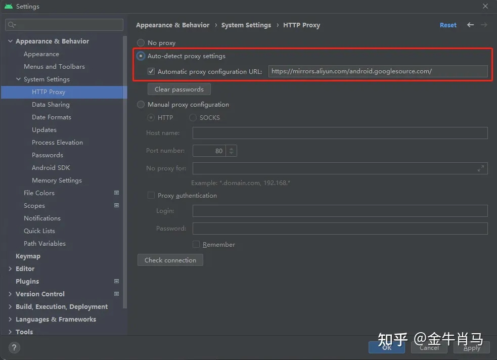

# 全栈实战 App 运营平台

## 环境搭建

### 安装 flutter 环境

如果有条件，可以遵循 [官方文档](https://flutter.dev/docs/get-started/install) 进行安装，如果没有条件，可以使用 [flutter.cn](https://flutter.cn/docs/get-started/install) 提供的镜像进行安装。

其中 `Android Studio` 如果无法安装，可以使用 [Android Studio 中国镜像](https://developer.android.google.cn/studio/index.html) 进行安装，如果还不行，只能大家在学习的 QQ 群中互助一下了。

安装完 `Android Studio` 后，还需要安装 `Android SDK` ，同样的，我们需要设置 `Android SDK` 中国镜像，否则会很慢。

如图红框标注位置，填入国内源地址（ https://mirrors.aliyun.com/android.googlesource.com/ ）后点 `Apply` 或 `OK` 键。

使用 `mac` 的同学，如果想使用 `iPhone` 模拟器，需要安装 `Xcode` ， 这个就直接使用官方的 App Store 进行安装就可以，速度可能比较慢，但目前没有可靠的镜像源。
