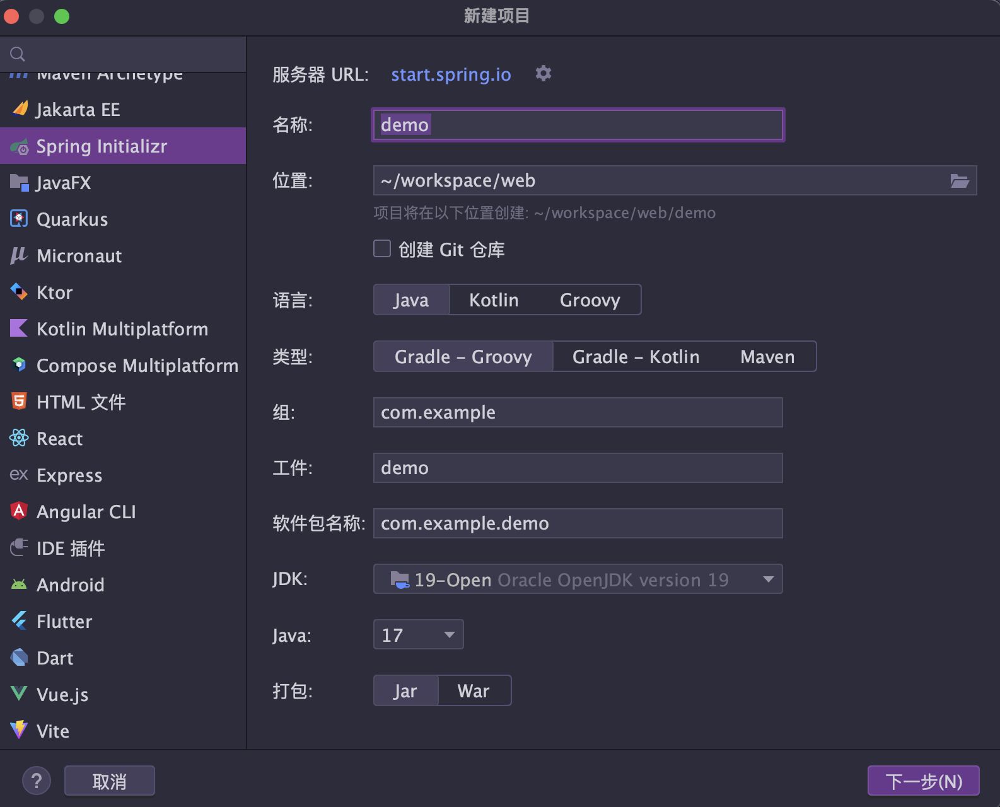
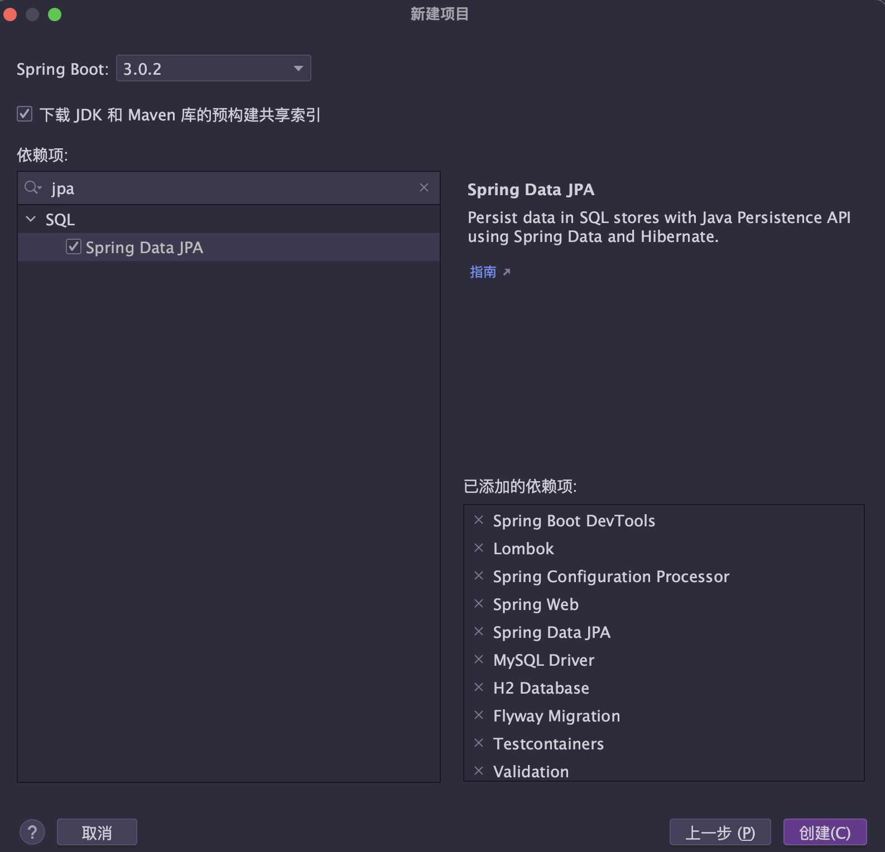

# 后台 API

<!-- @import "[TOC]" {cmd="toc" depthFrom=1 depthTo=6 orderedList=false} -->

<!-- code_chunk_output -->

- [后台 API](#-后台-api)
  - [Java 版本](#-java-版本)
    - [Java 各版本的新特性](#-java-各版本的新特性)
      - [Lambda 表达式](#-lambda-表达式)
      - [方法引用](#-方法引用)
      - [Stream API](#-stream-api)
      - [Optional](#-optional)
      - [Date/Time API](#-datetime-api)
      - [模块化系统](#-模块化系统)
      - [JShell](#-jshell)
      - [Process API](#-process-api)
      - [JFR](#-jfr)
      - [HttpClient](#-httpclient)
      - [JSON API](#-json-api)
      - [var](#-var)
      - [ZGC](#-zgc)
      - [Records](#-records)
      - [Switch 模式匹配](#-switch-模式匹配)
      - [Text Blocks](#-text-blocks)
      - [Pattern Matching for instanceof](#-pattern-matching-for-instanceof)
      - [Sealed Classes](#-sealed-classes)
  - [SpringBoot 对 Gradle 的支持](#-springboot-对-gradle-的支持)
    - [在 IDEA 中创建 Gradle 项目](#-在-idea-中创建-gradle-项目)
    - [Gradle 的基本语法](#-gradle-的基本语法)
    - [Gradle 的依赖管理](#-gradle-的依赖管理)
    - [Gradle 的任务](#-gradle-的任务)
    - [Gradle 的仓库](#-gradle-的仓库)
    - [命令行](#-命令行)
  - [SpringBoot 的测试](#-springboot-的测试)
    - [单元测试](#-单元测试)
      - [Mock](#-mock)
      - [MockMvc](#-mockmvc)
    - [集成测试](#-集成测试)
      - [Spring Boot 的集成测试](#-spring-boot-的集成测试)
    - [测试的配置文件](#-测试的配置文件)
  - [Spring Data JPA](#-spring-data-jpa)
    - [Spring Data JPA 的使用](#-spring-data-jpa-的使用)
      - [Spring Data JPA 的依赖](#-spring-data-jpa-的依赖)
      - [Spring Data JPA 的配置](#-spring-data-jpa-的配置)
    - [Spring Data JPA 的实体类](#-spring-data-jpa-的实体类)
      - [实体类和数据库表的映射关系](#-实体类和数据库表的映射关系)
      - [实体类的主键生成策略](#-实体类的主键生成策略)
      - [实体类中枚举类型的映射](#-实体类中枚举类型的映射)
      - [在 API 参数中使用枚举](#-在-api-参数中使用枚举)
      - [表关联的映射](#-表关联的映射)
    - [表的自动创建](#-表的自动创建)
      - [导出数据库脚本](#-导出数据库脚本)
    - [Spring Data JPA 的接口](#-spring-data-jpa-的接口)
    - [Spring Data JPA 的查询](#-spring-data-jpa-的查询)
      - [命名形式查询](#-命名形式查询)
      - [返回的对象类型选择](#-返回的对象类型选择)
      - [@Query 注解查询](#-query-注解查询)
      - [Example 查询](#-example-查询)
      - [Specification 查询](#-specification-查询)
      - [自定义 Repository](#-自定义-repository)
    - [Spring Data JPA 的分页支持](#-spring-data-jpa-的分页支持)
    - [Spring Data JPA 的排序支持](#-spring-data-jpa-的排序支持)
      - [Slice 分页](#-slice-分页)
    - [Spring Data JPA 的测试](#-spring-data-jpa-的测试)
  - [Flyway 管理数据库版本](#-flyway-管理数据库版本)
  - [SpringBoot Validation](#-springboot-validation)
    - [Bean Validation](#-bean-validation)
  - [Lombok](#-lombok)
    - [@Data](#-data)
    - [@Builder](#-builder)
    - [@RequiredArgsConstructor](#-requiredargsconstructor)
    - [@Value](#-value)
    - [val](#-val)
    - [日志](#-日志)
    - [在实体类中使用需要注意的问题](#-在实体类中使用需要注意的问题)
  - [Rest API 的可测试文档 Swagger](#-rest-api-的可测试文档-swagger)
    - [添加依赖](#-添加依赖)
    - [添加配置](#-添加配置)
    - [使用](#-使用)

<!-- /code_chunk_output -->

后台的技术架构采用 `SpringBoot 3.0` , `SpringBoot 3.0` 是一次重大的升级， 要求 JDK 版本为 17 以上， 本项目采用 `JDK 19` 进行开发。

## Java 版本

Java 目前每年都会发布新的版本， 但是新版本的发布并不是每个人都能够及时的升级， 本项目采用 `JDK 19` 进行开发， 但是也会考虑向下兼容， 也就是说， 本项目的代码可以在 `JDK 17` 以上的版本上运行。
需要注意的是，在生产环境下我们最好使用 LTS 版本，也就是长期维护版本。Java 目前的 LTS 版本和其维护截止日期如下：

| 版本   | 维护截止日期 |
| ------ | ------------ |
| JDK 8  | 2025-03-18   |
| JDK 11 | 2026-09-14   |
| JDK 17 | 2029-09-14   |

中间的过渡版本会引入新的特性，但是不会有长期的维护，在新特性稳定后才会发布 LTS 版本。

### Java 各版本的新特性

| 版本   | 新特性                                                       |
| ------ | ------------------------------------------------------------ |
| JDK 8  | Lambda 表达式，方法引用，Stream API，Optional，Date/Time API |
| JDK 11 | 模块化系统，HTTP 客户端，JSON API，var，ZGC                  |
| JDK 17 | Records，Sealed Classes，Pattern Matching                    |

#### Lambda 表达式

Lambda 表达式是 Java 8 中引入的一个新特性，它允许把函数作为一个方法的参数（函数作为参数传递进方法中）。使用 Lambda 表达式可以使代码变的更加简洁紧凑。

```java
// Java 7
Collections.sort(list, new Comparator<String>() {
    @Override
    public int compare(String o1, String o2) {
        return o1.compareTo(o2);
    }
});

// Java 8
Collections.sort(list, (String o1, String o2) -> {
    return o1.compareTo(o2);
});
```

#### 方法引用

方法引用通过方法的名字来指向一个方法。方法引用可以使语言的构造更紧凑简洁，减少冗余代码。

```java
// Java 7
Collections.sort(list, new Comparator<String>() {
    @Override
    public int compare(String o1, String o2) {
        return o1.compareTo(o2);
    }
});

// Java 8
Collections.sort(list, String::compareTo);
```

#### Stream API

Stream API 是 Java 8 中引入的一个新特性，它提供了一种高效且易于使用的处理数据的方式。Stream API 可以处理集合、数组等数据源中的数据。Stream API 不会改变原来的数据源，而是返回一个持有结果的新 Stream。

```java
// Java 7
List<String> strings = Arrays.asList("abc", "", "bc", "efg", "abcd", "", "jkl");
List<String> filtered = new ArrayList<>();
for (String string : strings) {
    if (!string.isEmpty()) {
        filtered.add(string);
    }
}

// Java 8
List<String> strings = Arrays.asList("abc", "", "bc", "efg", "abcd", "", "jkl");
List<String> filtered = strings.stream().filter(string -> !string.isEmpty()).collect(Collectors.toList());
```

#### Optional

Optional 类是 Java 8 中引入的一个新特性，它用来解决空指针异常。Optional 类的引入很好的解决空指针异常的问题，但是它也带来了一些问题，比如 Optional 类的使用不当会导致代码变得冗余，可读性差等问题。

```java
// Java 7
String name = null;
if (person != null) {
    name = person.getName();
}

// Java 8
String name = Optional.ofNullable(person).map(Person::getName).orElse("Unknown");
```

#### Date/Time API

Date/Time API 是 Java 8 中引入的一个新特性，它提供了一套新的 API 来处理日期和时间。Date/Time API 使日期和时间的处理变得更加简单，也解决了 Java 旧的日期和时间 API 存在的一些问题。

```java
// Java 7
Date date = new Date();
SimpleDateFormat sdf = new SimpleDateFormat("yyyy-MM-dd HH:mm:ss");
String formattedDate = sdf.format(date);

// Java 8
LocalDateTime now = LocalDateTime.now();
DateTimeFormatter formatter = DateTimeFormatter.ofPattern("yyyy-MM-dd HH:mm:ss");
String formattedDate = now.format(formatter);
```

#### 模块化系统

模块化系统是 Java 9 中引入的一个新特性，它允许把 Java 代码分成不同的模块，每个模块都有自己的命名空间，模块之间的依赖关系通过模块描述符来描述。模块化系统使得 Java 代码的组织变得更加清晰，也使得 Java 代码的重用变得更加容易。
简单来说模块化就是"Java 包的包"，在包的上一层再抽象一层，把包组织成模块，模块之间的依赖关系通过模块描述符来描述。

Java 从 JDK 9 开始本身就是一个模块化的系统，可以通过以下命令查看 Java 9 或以上的 JDK 中的模块。

```bash
java --list-modules
```

如果是 Java 11，那么你会看到下面的输出结果

```
java.base@11.0.17
java.compiler@11.0.17
java.datatransfer@11.0.17
java.desktop@11.0.17
java.instrument@11.0.17
java.logging@11.0.17
java.management@11.0.17
java.management.rmi@11.0.17
java.naming@11.0.17
java.net.http@11.0.17
java.prefs@11.0.17
java.rmi@11.0.17
java.scripting@11.0.17
java.se@11.0.17
java.security.jgss@11.0.17
java.security.sasl@11.0.17
java.smartcardio@11.0.17
java.sql@11.0.17
java.sql.rowset@11.0.17
java.transaction.xa@11.0.17
java.xml@11.0.17
java.xml.crypto@11.0.17
jdk.accessibility@11.0.17
jdk.attach@11.0.17
jdk.charsets@11.0.17
jdk.compiler@11.0.17
jdk.crypto.cryptoki@11.0.17
jdk.crypto.ec@11.0.17
jdk.dynalink@11.0.17
jdk.editpad@11.0.17
jdk.hotspot.agent@11.0.17
jdk.httpserver@11.0.17
jdk.internal.ed@11.0.17
jdk.internal.jvmstat@11.0.17
jdk.internal.le@11.0.17
jdk.internal.opt@11.0.17
jdk.internal.vm.ci@11.0.17
jdk.internal.vm.compiler@11.0.17
jdk.internal.vm.compiler.management@11.0.17
jdk.jartool@11.0.17
jdk.javadoc@11.0.17
jdk.jcmd@11.0.17
jdk.jconsole@11.0.17
jdk.jdeps@11.0.17
jdk.jdi@11.0.17
jdk.jdwp.agent@11.0.17
jdk.jfr@11.0.17
jdk.jlink@11.0.17
jdk.jshell@11.0.17
jdk.jsobject@11.0.17
jdk.jstatd@11.0.17
jdk.localedata@11.0.17
jdk.management@11.0.17
jdk.management.agent@11.0.17
jdk.management.jfr@11.0.17
jdk.naming.dns@11.0.17
jdk.naming.ldap@11.0.17
jdk.naming.rmi@11.0.17
jdk.net@11.0.17
jdk.pack@11.0.17
jdk.rmic@11.0.17
jdk.scripting.nashorn@11.0.17
jdk.scripting.nashorn.shell@11.0.17
jdk.sctp@11.0.17
jdk.security.auth@11.0.17
jdk.security.jgss@11.0.17
jdk.unsupported@11.0.17
jdk.unsupported.desktop@11.0.17
jdk.xml.dom@11.0.17
jdk.zipfs@11.0.17
```

#### JShell

JShell 是 Java 9 中引入的一个新特性，它是一个交互式的 Java 解释器，它可以用来执行 Java 代码，也可以用来执行 Java 代码片段。JShell 是一个 REPL（Read-Eval-Print-Loop）环境，它可以用来执行 Java 代码，也可以用来执行 Java 代码片段。

```bash
jshell> ++i
$5 ==> 4

jshell> int i = 1
i ==> 1

jshell> i++
$7 ==> 1

jshell> i
i ==> 2

jshell> ++i
$9 ==> 3
```

可以使用下面命令启动 JShell

```bash
jshell
```

#### Process API

Process API 是 Java 9 中引入的一个新特性，它是一个进程 API，它可以用来启动一个进程，也可以用来获取一个进程的信息。Process API 与 Java 8 中引入的 ProcessBuilder 非常类似，但是 Process API 的 API 更加简洁。

```java
ProcessHandle processHandle = ProcessHandle.current();
System.out.println(processHandle.pid());
System.out.println(processHandle.info().command());
System.out.println(processHandle.info().commandLine());
System.out.println(processHandle.info().user());
System.out.println(processHandle.info().startInstant());
System.out.println(processHandle.info().totalCpuDuration());
System.out.println(processHandle.info().arguments());
```

#### JFR

JFR 是 Java 11 中引入的一个新特性，它是一个 Java Flight Recorder，它可以用来记录 Java 应用程序的运行时信息，比如 CPU 使用率、内存使用率、线程数量、GC 次数等等。JFR 是一个非常强大的性能分析工具，它可以用来分析 Java 应用程序的性能问题。

```java
public class JfrDemo {
    public static void main(String[] args) throws IOException {
        try (FileOutputStream fos = new FileOutputStream("jfr-demo.jfr")) {
            FlightRecorderMXBean flightRecorderMXBean = ManagementFactory.getPlatformMXBean(FlightRecorderMXBean.class);
            flightRecorderMXBean.dumpFlightRecording("jfr-demo.jfr");
        }
    }
}
```

#### HttpClient

HttpClient 是 Java 11 中引入的一个新特性，它是一个 HTTP 客户端，它可以用来发送 HTTP 请求，也可以用来解析 HTTP 响应。HttpClient 是一个异步的 HTTP 客户端，它的 API 与 Java 8 中引入的 CompletableFuture 非常类似，它的 API 也是基于回调函数的。

```java
HttpClient client = HttpClient.newHttpClient();
HttpRequest request = HttpRequest.newBuilder()
    .uri(URI.create("https://www.baidu.com"))
    .build();
CompletableFuture<HttpResponse<String>> response = client.sendAsync(request, HttpResponse.BodyHandlers.ofString());
response.thenAccept(res -> System.out.println(res.body()));
```

#### JSON API

JSON API 是 Java 11 中引入的一个新特性，它是一个 JSON API，它可以用来解析 JSON 数据，也可以用来生成 JSON 数据。JSON API 是一个非常强大的 JSON 解析工具，它的 API 与 Java 8 中引入的 Stream API 非常类似，它的 API 也是基于回调函数的。

```java
JsonReader jsonReader = Json.createReader(new StringReader("{\"name\":\"zhangsan\",\"age\":18}"));
JsonObject jsonObject = jsonReader.readObject();
jsonReader.close();
System.out.println(jsonObject.getString("name"));
System.out.println(jsonObject.getInt("age"));
```

#### var

var 是 Java 10 中引入的一个新特性，它是一个关键字，它可以用来声明一个变量，它的类型会根据变量的初始化表达式自动推断出来。var 是一个非常强大的特性，它可以让代码更加简洁，也可以让代码更加易读。

```java
var i = 1;
var s = "hello";
var list = new ArrayList<String>();
```

#### ZGC

ZGC 是 Java 11 中引入的一个新特性，它是一个 Z Garbage Collector，它是一个低延迟的垃圾收集器，它可以用来替代 CMS 垃圾收集器。ZGC 是一个非常强大的垃圾收集器，它可以让 Java 应用程序的响应时间更加稳定。
在 Java 11 环境启用 ZGC 垃圾收集器，需要在启动参数中添加如下配置：

```java
-XX:+UnlockExperimentalVMOptions
-XX:+UseZGC
```

#### Records

Records 是 Java 14 中引入的一个新特性，它是一个记录，它可以用来声明一个记录，它的属性会根据构造函数的参数自动推断出来。Records 是一个非常强大的特性，它可以让代码更加简洁，也可以让代码更加易读。

在没有它之前，我们一般会使用 Lombok 来生成 getter、setter、toString、equals、hashCode 等方法，但是对于 Records 来说，它已经自带了这些方法，所以我们不需要再使用 Lombok 来生成这些方法了。
当然它还无法完全取代 Lombok，因为它还不支持 @Data、@Builder、@AllArgsConstructor、@NoArgsConstructor、@RequiredArgsConstructor 等注解，所以我们还是需要使用 Lombok 来生成这些方法。
而且对于 JPA 的实体类来说，它还不支持 @Entity、@Table、@Id、@GeneratedValue 等注解，所以我们还是需要使用 Lombok 来生成这些注解。

目前来说它的最佳使用场景是 DTO，比如我们可以使用它来声明一个 UserDTO，它的属性会根据构造函数的参数自动推断出来。

```java
public record UserDTO(String name, int age) {
}
```

在 Spring Data 中，我们进行查询时，需要的结构往往和实体类有一定区别，这时候我们就可以使用它来声明一个 DTO，由于 Record 的简洁性，我们省去了原来的很多代码。

```java
public interface UserRepository extends JpaRepository<User, Long> {
    @Query("select new com.example.demo.UserDTO(u.name, u.age) from User u")
    List<UserDTO> findAllUserDTO();
}
```

#### Switch 模式匹配

Switch 模式匹配 是 Java 12 中引入的一个新特性，它是一个 switch 表达式，它可以用来替代 switch 语句，它的语法更加简洁，也更加易读。

```java
var i = switch (s) {
    case "hello" -> 1;
    case "world" -> 2;
    default -> 3;
};
```

#### Text Blocks

Text Blocks 是 Java 15 中引入的一个新特性，它是一个文本块，它可以用来替代字符串拼接，它的语法更加简洁，也更加易读。

```java
var s = """
    hello
    world
    """;
```

如果字符串中有变量，可以使用 ${} 来引用变量。

```java
var s = """
    hello
    ${name}
    """;
```

#### Pattern Matching for instanceof

Pattern Matching for instanceof 是 Java 14 中引入的一个新特性，它是一个 instanceof 表达式，它可以用来替代 instanceof 语句，它的语法更加简洁，也更加易读。

```java
if (obj instanceof String s) {
    System.out.println(s);
}
```

#### Sealed Classes

Sealed Classes 是 Java 15 中引入的一个新特性，它是一个密封类，它可以用来声明一个密封类，它的子类只能在当前文件中声明，它的语法更加简洁，也更加易读。

```java
public sealed class Shape permits Circle, Rectangle {
}

public final class Circle extends Shape {
}

public final class Rectangle extends Shape {
}
```

## SpringBoot 对 Gradle 的支持

SpringBoot 对 Maven 和 Gradle 的支持都非常好，它支持多种类型的项目，比如普通的 Java 项目、Web 项目、SpringBoot 项目、SpringCloud 项目等。

目前的趋势是使用 Gradle 来构建项目，因为它的语法更加简洁，也更加易读。而且 Gradle 是基于 Groovy 的，Groovy 是一种动态语言，它更加强大，也更加灵活。

### 在 IDEA 中创建 Gradle 项目

我们采用 `Spring Initializr` 来创建一个 Gradle 项目。在 IDEA 中，我们可以通过 `File -> New -> Project` 来创建一个新的项目。



然后选中 `Spring Initializr`，语言选中 `Java`，类型选择 `Gradle - Groovy`，JDK 版本选择 `19`，Java 选择 `19` ，然后点击 `下一步`。



`Spring Boot` 选择 `3.0.2` ，然后在依赖项中选择图中右侧所示的依赖项，然后点击 `创建`。

### Gradle 的基本语法

创建工程后，在项目根目录下会生成一个 `build.gradle` 文件，这个文件就是 Gradle 的构建文件，它的语法和 Maven 的 POM 文件的语法非常类似。

```groovy
plugins {
    id 'java'
    id 'org.springframework.boot' version '3.0.2'
    id 'io.spring.dependency-management' version '1.1.0'
}

group = 'com.mooc'
version = '0.0.1-SNAPSHOT'
sourceCompatibility = '17'

configurations {
    compileOnly {
        extendsFrom annotationProcessor
    }
}

repositories {
    mavenCentral()
}

ext {
    set('testcontainersVersion', "1.17.6")
}

dependencies {
    implementation 'org.springdoc:springdoc-openapi-starter-webmvc-ui:2.0.2'
    implementation 'org.springframework.boot:spring-boot-starter-data-jpa'
    implementation 'org.springframework.boot:spring-boot-starter-web'
    implementation 'org.springframework.boot:spring-boot-starter-validation'
    implementation 'io.hypersistence:hypersistence-utils-hibernate-60:3.1.1'
    implementation 'com.qiniu:qiniu-java-sdk:7.12.1'
    implementation 'org.flywaydb:flyway-core'
    implementation 'org.flywaydb:flyway-mysql'
    compileOnly 'org.projectlombok:lombok'
    developmentOnly 'org.springframework.boot:spring-boot-devtools'
    runtimeOnly 'com.h2database:h2'
    runtimeOnly 'com.mysql:mysql-connector-j'
    annotationProcessor 'org.springframework.boot:spring-boot-configuration-processor'
    annotationProcessor 'org.projectlombok:lombok'
    testImplementation 'org.springframework.boot:spring-boot-starter-test'
    testImplementation 'org.hamcrest:hamcrest-library'
    testImplementation 'org.testcontainers:junit-jupiter'
    testImplementation 'org.testcontainers:mysql'
}

tasks.named('test') {
    useJUnitPlatform()
}
```

其中，`plugins` 用来声明插件，`repositories` 用来声明仓库，`dependencies` 用来声明依赖，`tasks` 用来声明任务。

### Gradle 的依赖管理

Gradle 的依赖管理和 Maven 的依赖管理非常类似，它也是通过 groupId、artifactId 和 version 来唯一标识一个依赖。

- `implementation` 用来声明编译时和运行时的依赖
- `compileOnly` 用来声明编译时的依赖，
- `runtimeOnly` 用来声明运行时的依赖，
- `testImplementation` 用来声明测试时的依赖。

如果遇到依赖冲突，可以使用 `resolutionStrategy` 来解决。

```groovy
configurations.all {
    resolutionStrategy {
        force 'org.springframework.boot:spring-boot-starter-web:2.5.5'
    }
}
```

也可以使用 `exclude` 来排除依赖。

```groovy
dependencies {
    implementation('org.springframework.boot:spring-boot-starter-web') {
        exclude group: 'org.springframework.boot', module: 'spring-boot-starter-tomcat'
    }
}
```

### Gradle 的任务

Gradle 的任务和 Maven 的插件非常类似，它也是通过 `tasks` 来声明任务，然后通过 `doLast` 来声明任务的具体内容。比如我们可以通过下面的方式来声明一个 `hello` 任务。

```groovy
task hello {
    doLast {
        println 'Hello Gradle!'
    }
}
```

再一个例子，比如我们在编译后，将一个目录下的文件复制到另一个目录下，可以通过下面的方式来实现。

```groovy
task copyFiles(type: Copy) {
    from 'src/main/resources'
    into 'build/resources/main'
}
```

和 Maven 类似的，我们可以指定在某个生命周期中执行某个任务，比如我们可以在 `compileJava` 任务之后执行 `copyFiles` 任务。

```groovy
compileJava.dependsOn copyFiles
```

### Gradle 的仓库

Gradle 的仓库和 Maven 的仓库非常类似，它也是通过 `repositories` 来声明仓库，然后通过 `maven` 来声明 Maven 仓库，通过 `jcenter` 来声明 JCenter 仓库，通过 `mavenCentral` 来声明 Maven 中央仓库。

```groovy
repositories {
    maven { url 'https://repo.spring.io/milestone' }
    jcenter()
    mavenCentral()
}
```

### 命令行

Gradle 的命令行和 Maven 的命令行非常类似，它也是通过 `gradle` 命令来执行任务，比如我们可以通过 `gradle hello` 来执行 `hello` 任务。

启动 SpringBoot 应用的命令也是一样的，比如我们可以通过 `gradle bootRun` 来启动 SpringBoot 应用。

## SpringBoot 的测试

SpringBoot 对于各种类型的测试的支持都非常好，它支持单元测试、集成测试、Web 测试、数据库测试等。

### 单元测试

进行单元测试时，我们需要使用 @SpringBootTest 注解来启动 SpringBoot 应用，然后使用 @Autowired 注解来注入需要测试的 Bean，最后使用 @Test 注解来声明测试方法。

```java
@SpringBootTest
class DemoApplicationTests {

    @Autowired
    private UserService userService;

    @Test
    void contextLoads() {
        System.out.println(userService.findAll());
    }

}
```

#### Mock

在进行单元测试时，我们可能会经常遇到 Mock 的情况，Mock 是一种模拟对象，它可以用来模拟一个对象的行为，我们可以通过 Mockito 来进行 Mock。
比如我们有一个 UserService 类，它依赖于一个 UserRepository 类，我们可以通过 Mockito 来模拟 UserRepository 类的行为，然后将模拟的 UserRepository 类注入到 UserService 类中，这样我们就可以对 UserService 类进行单元测试了。

```java
@SpringBootTest
class DemoApplicationTests {

    @Autowired
    private UserService userService;

    @Test
    void contextLoads() {
        var userRepository = Mockito.mock(UserRepository.class);
        Mockito.when(userRepository.findAll()).thenReturn(List.of(new User()));
        userService.setUserRepository(userRepository);
        System.out.println(userService.findAll());
    }

}
```

上面代码中，我们通过 Mockito 来模拟 UserRepository 类的 findAll 方法，然后将模拟的 UserRepository 类注入到 UserService 类中，这样我们就可以对 UserService 类进行单元测试了。

很多初次接触 Mock 概念的同学可能会有疑问，为什么要使用 Mock 呢？我们可以通过下面的代码来对比一下使用 Mock 和不使用 Mock 的区别。

```java
@SpringBootTest
class DemoApplicationTests {

    @Autowired
    private UserService userService;

    @Test
    void contextLoads() {
        System.out.println(userService.findAll());
    }

}
```

上面代码中，我们没有使用 Mock，而是直接调用了 UserService 类的 findAll 方法，这样的话，我们就需要在测试环境中配置好数据库，然后在测试之前先往数据库中插入一些数据，这样才能保证测试的正确性，这样的话，我们的测试就和生产环境耦合在了一起，我们的测试就不是一个单元测试了，而是一个集成测试。
这种集成测试要求你的所有依赖都要正常运行起来，比如数据库，比如 Redis，比如 RabbitMQ 等等，这样的话，你的测试就会变得非常复杂。

#### MockMvc

在进行 Web 层的单元测试时，我们可以使用 MockMvc 来进行测试，MockMvc 是 Spring 提供的一个模拟 MVC 请求的工具类，它可以模拟发送 HTTP 请求，然后对返回的结果进行断言。

```java
@SpringBootTest
class DemoApplicationTests {

    @Autowired
    private MockMvc mockMvc;

    @Test
    void contextLoads() throws Exception {
        mockMvc.perform(MockMvcRequestBuilders.get("/user"))
                .andExpect(MockMvcResultMatchers.status().isOk())
                .andExpect(MockMvcResultMatchers.jsonPath("$.length()").value(2))
                .andExpect(MockMvcResultMatchers.jsonPath("$[0].name"), Matchers.is("张三"));
    }
}
```

上面代码中，我们使用 MockMvc 来模拟发送了一个 GET 请求，然后对返回的结果进行了断言，断言的结果是返回的状态码是 200，然后断言返回的结果是一个 JSON 数组，数组的长度是 2。

注意 `$` 符号，它表示的是根节点，也就是整个 JSON 对象，`$.length()` 表示的是 JSON 数组的长度。如果 JSON 数组中的元素是一个对象，我们也可以使用 `$.name` 来获取对象中的 name 属性。
如果你的代码编译出错，提示找不到 `Matchers.is` 方法，那么你需要在 `build.gradle` 文件中添加如下依赖：

```groovy
testImplementation 'org.hamcrest:hamcrest-library'
```

上面代码中会把所有 Spring Boot 的上下文都加载进来，这样一方面是非常耗时的，另一方面也会影响测试的效率，所以我们可以使用 `@WebMvcTest` 来进行测试，它只会加载 Web 层的上下文，而不会加载 Spring Boot 的上下文。

```java
@WebMvcTest
class DemoApplicationTests {

    @Autowired
    private MockMvc mockMvc;

    @Test
    void test() throws Exception {
        mockMvc.perform(MockMvcRequestBuilders.get("/user"))
                .andExpect(MockMvcResultMatchers.status().isOk())
                .andExpect(MockMvcResultMatchers.jsonPath("$.length()").value(2))
                .andExpect(MockMvcResultMatchers.jsonPath("$[0].name"), Matchers.is("张三"));
    }
}
```

甚至我们可以指定只加载某个 Controller 的上下文，这样可以进一步提高测试的效率。

```java
@WebMvcTest(UserController.class)
class DemoApplicationTests {

    @Autowired
    private MockMvc mockMvc;

    @Test
    void test() throws Exception {
        mockMvc.perform(MockMvcRequestBuilders.get("/user"))
                .andExpect(MockMvcResultMatchers.status().isOk())
                .andExpect(MockMvcResultMatchers.jsonPath("$.length()").value(2))
                .andExpect(MockMvcResultMatchers.jsonPath("$[0].name"), Matchers.is("张三"));
    }
}
```

### 集成测试

集成测试是指将多个模块组合在一起进行测试，它的目的是为了验证各个模块之间的交互是否符合预期，以及验证整个系统是否符合需求。

#### Spring Boot 的集成测试

Spring Boot 提供了一个测试工具类 `SpringBootTest`，它可以帮助我们快速地进行集成测试，我们只需要在测试类上添加 `@SpringBootTest` 注解，然后在测试方法上添加 `@Test` 注解，就可以进行集成测试了。

集成测试中我们可能需要一些外部的资源，比如数据库，比如 Redis，比如 RabbitMQ 等等，有的情况下我们还需要指定测试用例的生命周期。比如，我们需要在测试用例执行之前，先启动一个容器，然后在测试用例执行之后，再关闭这个容器，这时候我们就可以使用 `@TestInstance` 注解来指定测试用例的生命周期，比如：

SpringBoot 提供了 `testcontainers` 的依赖，我们可以使用 `testcontainers` 来启动一个容器，比如：

```java
@DataJpaTest
@TestInstance(TestInstance.Lifecycle.PER_CLASS)
class DemoApplicationTests {
    private static final MySQLContainer<?> mySQLContainer = new MySQLContainer<>("mysql:8.0.22")
            .withDatabaseName("test")
            .withUsername("root")
            .withPassword("root");

    @BeforeAll
    static void beforeAll() {
        mySQLContainer.start();
    }

    @AfterAll
    static void afterAll() {
        mySQLContainer.stop();
    }
}
```

这种测试容器的方式，可以让我们的测试用例更加独立，不会受到其他测试用例的影响。

添加 `testcontainers` 依赖，比如希望集成测试时有 MySQL ：

```groovy
dependencies {
    // ...
    testImplementation 'org.testcontainers:mysql:1.17.6'
}
```

注意，这个版本号不一定要和文档一致，最新版本号参考：[https://mvnrepository.com/artifact/org.testcontainers/mysql](https://mvnrepository.com/artifact/org.testcontainers/mysql)

不只是数据库，我们还可以使用 `testcontainers` 来启动一个 Redis 容器，比如：

```java
@DataJpaTest
@TestInstance(TestInstance.Lifecycle.PER_CLASS)
class DemoApplicationTests {
    private static final GenericContainer<?> redisContainer = new GenericContainer<>("redis:6.0.9")
            .withExposedPorts(6379);

    @BeforeAll
    static void beforeAll() {
        redisContainer.start();
    }

    @AfterAll
    static void afterAll() {
        redisContainer.stop();
    }
}
```

`testcontainers` 具体的文档可以参考：[https://www.testcontainers.org/](https://www.testcontainers.org/)

和每个测试添加 `@TestInstance(TestInstance.Lifecycle.PER_CLASS)` 注解不同，我们可以通过在 `tests/resources` 目录下创建一个 `junit-platform.properties` 来全局设置测试用例的生命周期，比如：

```properties
junit.jupiter.testinstance.lifecycle.default = per_class
```

除了 `PER_CLASS`, 还有 `PER_METHOD` 也就是按方法的生命周期，具体的可以参考：[https://junit.org/junit5/docs/current/user-guide/#writing-tests-test-instance-lifecycle](https://junit.org/junit5/docs/current/user-guide/#writing-tests-test-instance-lifecycle)

### 测试的配置文件

在测试中，我们可能需要使用不同的配置文件，比如，我们在开发环境中使用的是 `application-dev.yml`，但是在测试环境中，我们可能需要使用 `application-test.yml`，这时候我们可以通过 `@ActiveProfiles` 注解来指定测试用例使用的配置文件，比如：

```java
@DataJpaTest
@ActiveProfiles("test")
class DemoApplicationTests {
}
```

也可以使用 `@TestPropertySource` 注解来指定测试用例使用的配置文件，比如：

```java
@DataJpaTest
@TestPropertySource("classpath:application-test.yml")
class DemoApplicationTests {
}
```

## Spring Data JPA

### Spring Data JPA 的使用

Spring Data JPA 是 Spring Data 的一个子项目，它是一个基于 JPA 的数据访问层框架，它可以让我们在不写任何代码的情况下，通过简单的配置就可以实现对数据库的增删改查操作。

#### Spring Data JPA 的依赖

Spring Data JPA 的依赖如下：

```groovy
implementation 'org.springframework.boot:spring-boot-starter-data-jpa'
```

#### Spring Data JPA 的配置

Spring Data JPA 的样例配置如下：

```properties
spring.datasource.url=jdbc:mysql://localhost:3306/test?useUnicode=true&characterEncoding=utf-8&useSSL=false&serverTimezone=GMT%2B8
spring.datasource.username=root
spring.datasource.password=123456
spring.datasource.driver-class-name=com.mysql.cj.jdbc.Driver
spring.jpa.database=mysql
spring.jpa.show-sql=true
spring.jpa.hibernate.ddl-auto=update
spring.jpa.properties.hibernate.dialect=org.hibernate.dialect.MySQL5InnoDBDialect
```

### Spring Data JPA 的实体类

实体类是一个简单的 POJO，它需要使用 JPA 的注解来标注它的属性，比如：

```java
@Entity
public class User {
    @Id
    @GeneratedValue(strategy = GenerationType.IDENTITY)
    private Long id;

    private String name;

    private Integer age;

    // getter and setter
}
```

上面代码中，我们使用了 `@Entity` 注解来标注这是一个实体类，使用 `@Id` 注解来标注这是一个主键，使用 `@GeneratedValue` 注解来标注这是一个自增的主键。
此外，我们还可以使用 `@Table` 注解来标注这个实体类对应的表名，比如：

```java
@Entity
@Table(name = "t_user")
public class User {
    // ...
}
```

默认字段名和属性名一致，如果不一致，可以使用 `@Column` 注解来标注，比如：

```java
@Entity
public class User {
    @Id
    @GeneratedValue(strategy = GenerationType.IDENTITY)
    private Long id;

    @Column(name = "user_name")
    private String name;

    private Integer age;

    // getter and setter
}
```

在 `@Column` 注解中，我们还可以设置 `nullable`、`unique`、`length` 等属性，比如：

```java
@Entity
public class User {
    @Id
    @GeneratedValue(strategy = GenerationType.IDENTITY)
    private Long id;

    @Column(name = "user_name", nullable = false, unique = true, length = 20)
    private String name;

    private Integer age;

    // getter and setter
}
```

此外，我们还可以使用 `@Temporal` 注解来标注日期类型的属性，比如：

```java
@Entity
public class User {
    @Id
    @GeneratedValue(strategy = GenerationType.IDENTITY)
    private Long id;

    @Column(name = "user_name", nullable = false, unique = true, length = 20)
    private String name;

    private Integer age;

    @Temporal(TemporalType.TIMESTAMP)
    private Date createTime;

    // getter and setter
}
```

当然在 Spring Data JPA 中，我们即使不使用 `@Temporal` 注解，也可以使用 `java.time` 包中的日期类型，比如：

```java
@Entity
public class User {
    @Id
    @GeneratedValue(strategy = GenerationType.IDENTITY)
    private Long id;

    @Column(name = "user_name", nullable = false, unique = true, length = 20)
    private String name;

    private Integer age;

    private LocalDateTime createTime;

    // getter and setter
}
```

框架会自动将 `java.time` 包中的日期类型转换为数据库中的日期类型。

对于二进制或者大文本类型的属性，我们可以使用 `@Lob` 注解来标注，比如：

```java
@Entity
public class User {
    @Id
    @GeneratedValue(strategy = GenerationType.IDENTITY)
    private Long id;

    @Column(name = "user_name", nullable = false, unique = true, length = 20)
    private String name;

    private Integer age;

    @Lob
    private byte[] avatar;

    // getter and setter
}
```

#### 实体类和数据库表的映射关系

在 Spring Data JPA 中，实体类和数据库表的映射关系如下：

| 实体类属性类型 | 数据库字段类型 |
| -------------- | -------------- |
| String         | VARCHAR        |
| Integer        | INT            |
| Long           | BIGINT         |
| Float          | FLOAT          |
| Double         | DOUBLE         |
| BigDecimal     | DECIMAL        |
| Boolean        | BIT            |
| Date           | DATETIME       |
| byte[]         | BLOB           |

#### 实体类的主键生成策略

在 Spring Data JPA 中，我们可以使用 `@Id` 注解来标注实体类的主键，比如：

```java
@Entity
public class User {
    @Id
    @GeneratedValue(strategy = GenerationType.IDENTITY)
    private Long id;

    // getter and setter
}
```

在 `@GeneratedValue` 注解中，我们可以设置 `strategy` 属性来指定主键生成策略，比如：

| 主键生成策略 | 说明                                                                                       |
| ------------ | ------------------------------------------------------------------------------------------ |
| AUTO         | 主键由程序控制，是默认选项，不设置就是这个策略。                                           |
| IDENTITY     | 主键由数据库自动生成（主要是自动增长型）                                                   |
| SEQUENCE     | 通过数据库的序列产生主键，通过 `@SequenceGenerator` 注解指定序列名，MySql 不支持这种方式。 |
| TABLE        | 通过特定的数据库表产生主键，使用该策略可以使应用更易于数据库移植。                         |

#### 实体类中枚举类型的映射

在 Spring Data JPA 中，我们可以使用 `@Enumerated` 注解来标注实体类中的枚举类型，比如：

```java
@Entity
@Table(name = "mooc_pages")
public class PageEntity extends Auditable {
    @Id
    @GeneratedValue(strategy = GenerationType.IDENTITY)
    @Column(name = "id", nullable = false)
    private Long id;

    @Column(name = "title", nullable = false, unique = true)
    private String title;

    @Enumerated(EnumType.STRING)
    @Column(name = "platform", nullable = false)
    private Platform platform;

    @Enumerated(EnumType.STRING)
    @Column(name = "page_type", nullable = false)
    private PageType pageType;

    @Enumerated(EnumType.ORDINAL)
    @Column(name = "status", nullable = false)
    private PageStatus status = PageStatus.Draft;
}
```

在 `@Enumerated` 注解中，我们可以设置 `EnumType` 属性来指定枚举类型的映射方式，比如：

| 枚举类型映射方式 | 说明                                                                        |
| ---------------- | --------------------------------------------------------------------------- |
| ORDINAL          | 默认值，使用枚举的序数来映射枚举类型，比如：`PageStatus.Draft` 映射为 `0`。 |
| STRING           | 使用枚举的名称来映射枚举类型，比如：`PageStatus.Draft` 映射为 `Draft`。     |

注意采用不同的策略，会影响到枚举类型的值的存储，比如：

```sql
mysql> desc mooc_pages;
+------------+--------------+------+-----+---------+----------------+
| Field      | Type         | Null | Key | Default | Extra          |
+------------+--------------+------+-----+---------+----------------+
| id         | bigint(20)   | NO   | PRI | NULL    | auto_increment |
| title      | varchar(255) | NO   | UNI | NULL    |                |
| platform   | varchar(255) | NO   |     | NULL    |                |
| page_type  | varchar(255) | NO   |     | NULL    |                |
| status     | int(11)      | NO   |     | 0       |                |
| created_at | datetime     | YES  |     | NULL    |                |
| updated_at | datetime     | YES  |     | NULL    |                |
+------------+--------------+------+-----+---------+----------------+
```

一般来说，我们会采用 `STRING` 策略来映射枚举类型，这样可以避免枚举类型的值发生变化时，数据库中的值也会发生变化。

很多时候，我们可能会类型参数的枚举类型，比如：

```java
public enum PageType {
    Home("首页"),
    About("关于我们"),
    Contact("联系我们"),
    News("新闻中心"),
    Product("产品中心"),
    Service("服务中心");

    private String value;

    PageType(String value) {
        this.value = value;
    }

    @JsonValue
    public String getValue() {
        return value;
    }

    @JsonCreator
    public static PageType fromValue(String value) {
        for (PageType pageType : PageType.values()) {
            if (pageType.getValue().equals(value)) {
                return pageType;
            }
        }
        throw new IllegalArgumentException("No matching constant for [" + value + "]");
    }
}
```

注意，上面的 `@JsonValue` 和 `@JsonCreator` 注解是用来支持 JSON 序列化和反序列化的，如果我们不使用这两个注解，那么在序列化和反序列化时，枚举类型的值会变成枚举类型的名称，比如：

```json
{
  "id": 1,
  "title": "首页",
  "platform": "PC",
  "pageType": "Home",
  "status": "Draft",
  "createdAt": "2019-03-01T16:00:00",
  "updatedAt": "2019-03-01T16:00:00"
}
```

如果我们使用了 `@JsonValue` 和 `@JsonCreator` 注解，那么在序列化和反序列化时，枚举类型的值会变成枚举类型的值，比如：

```json
{
  "id": 1,
  "title": "首页",
  "platform": "PC",
  "pageType": "首页",
  "status": "草稿",
  "createdAt": "2019-03-01T16:00:00",
  "updatedAt": "2019-03-01T16:00:00"
}
```

#### 在 API 参数中使用枚举

比如在一个 `@GetMapping` 注解的方法中，我们可以使用 `@RequestParam` 注解来接收 API 参数，比如：

```java
@GetMapping("/pages")
public List<Page> getPages(@RequestParam("page_type") PageType pageType) {
    return pageService.getPages(pageType);
}
```

这样，我们就可以通过 `page_type` 参数来指定查询的页面类型，比如：

```bash
curl http://localhost:8080/pages?page_type=home
```

但要注意的是如果 PageType 是一个有类型参数的枚举的话，我们需要自定义一个 converter 来将 API 参数转换成枚举类型，比如：

```java
import com.mooc.backend.enumerations.PageType;
import org.springframework.context.annotation.Configuration;
import org.springframework.core.convert.converter.Converter;

@Configuration
public class PageTypeConverter implements Converter<String, PageType> {
    @Override
    public PageType convert(String source) {
        return PageType.fromValue(source);
    }
}
```

我们只需添加 `@Configuration` 注解，框架会自动注册这个 `Converter`，在请求中遇到参数实际值是 `String` 但是参数类型是 `PageType` 时，就会自动调用这个 `Converter` 来转换参数值。

#### 表关联的映射

在 Spring Data JPA 中，我们可以使用 `@ManyToOne`、`@OneToOne`、`@OneToMany`、`@ManyToMany` 注解来标注实体类之间的关联关系，比如：

```java
@Entity
public class User {
    @Id
    @GeneratedValue(strategy = GenerationType.IDENTITY)
    private Long id;

    @Column(name = "user_name", nullable = false, unique = true, length = 20)
    private String name;

    private Integer age;

    @ManyToOne
    @JoinColumn(name = "role_id")
    private Role role;

    // getter and setter
}

@Entity
public class Role {
    @Id
    @GeneratedValue(strategy = GenerationType.IDENTITY)
    private Long id;

    @Column(name = "role_name", nullable = false, unique = true, length = 20)
    private String name;

    // getter and setter
}
```

在上面的代码中，我们使用 `@ManyToOne` 注解来标注 `User` 实体类和 `Role` 实体类之间的多对一关联关系，使用 `@JoinColumn` 注解来标注外键列。

如果一个用户有多个角色，我们可以使用 `@ManyToMany` 注解来标注实体类之间的关联关系，比如：

```java
@Entity
public class User {
    @Id
    @GeneratedValue(strategy = GenerationType.IDENTITY)
    private Long id;

    private String username;

    @ManyToMany(cascade = CascadeType.ALL)
    @JoinTable(
            name = "user_role",
            joinColumns = @JoinColumn(name = "user_id", referencedColumnName = "id"),
            inverseJoinColumns = @JoinColumn(name = "role_id", referencedColumnName = "id")
    )
    private Set<Role> roles = new HashSet<>();

    // getters and setters
}

@Entity
public class Role {
    @Id
    @GeneratedValue(strategy = GenerationType.IDENTITY)
    private Long id;

    private String name;

    @ManyToMany(mappedBy = "roles")
    private Set<User> users = new HashSet<>();

    // getters and setters
}

public interface UserRepository extends JpaRepository<User, Long> {
}

public interface RoleRepository extends JpaRepository<Role, Long> {
}

@Service
public class UserRoleService {
    @Autowired
    private UserRepository userRepository;

    @Autowired
    private RoleRepository roleRepository;

    @Transactional
    public void assignRoleToUser(Long userId, Long roleId) {
        User user = userRepository.findById(userId).orElse(null);
        Role role = roleRepository.findById(roleId).orElse(null);
        if (user != null && role != null) {
            user.getRoles().add(role);
            role.getUsers().add(user);
            userRepository.save(user);
        }
    }
}
```

在上面的代码中，我们使用 `@ManyToMany` 注解来标注 `User` 实体类和 `Role` 实体类之间的多对多关联关系，使用 `@JoinTable` 注解来标注中间表的信息。
实际创建表的时候，Spring Data JPA 会自动创建中间表，中间表的名称为 `user_role`，中间表的外键列分别为 `user_id` 和 `role_id`。
在 `Role` 实体类中，我们使用 `@ManyToMany` 注解的 `mappedBy` 属性来标注 `User` 实体类中的 `roles` 属性。
在保存的时候，请注意，我们必须要保存外键关系所在的实体类，否则外键关系不会被保存，这里就是 `User` 实体类。

另外需要注意的是在实体类中对于 `users` 和 `roles` 我们采用的是 Set 集合，这是因为在多对多关系中，我们不希望出现重复的数据，所以我们使用 Set 集合来存储数据。
而且不能忽略的是 Set 生成的 SQL 语句比 List 生成的 SQL 更高效。

比如我们有如下的实体类：

```java
@Entity(name = "Post")
@Table(name = "post")
public class Post {

    @Id
    @GeneratedValue
    private Long id;

    private String title;

    public Post() {}

    public Post(String title) {
        this.title = title;
    }

    @ManyToMany(cascade = {
            CascadeType.PERSIST,
            CascadeType.MERGE
    })
    @JoinTable(name = "post_tag",
            joinColumns = @JoinColumn(name = "post_id"),
            inverseJoinColumns = @JoinColumn(name = "tag_id")
    )
    private List<Tag> tags = new ArrayList<>();

    public void addTag(Tag tag) {
        tags.add(tag);
        tag.getPosts().add(this);
    }

    public void removeTag(Tag tag) {
        tags.remove(tag);
        tag.getPosts().remove(this);
    }

    @Override
    public boolean equals(Object o) {
        if (this == o) return true;
        if (!(o instanceof Post)) return false;
        return id != null && id.equals(((Post) o).getId());
    }

    @Override
    public int hashCode() {
        return getClass().hashCode();
    }
}

@Entity(name = "Tag")
@Table(name = "tag")
public class Tag {

    @Id
    @GeneratedValue
    private Long id;

    @NaturalId
    private String name;

    @ManyToMany(mappedBy = "tags")
    private List<Post> posts = new ArrayList<>();

    public Tag() {}

    public Tag(String name) {
        this.name = name;
    }

    @Override
    public boolean equals(Object o) {
        if (this == o) return true;
        if (o == null || getClass() != o.getClass()) return false;
        Tag tag = (Tag) o;
        return Objects.equals(name, tag.name);
    }

    @Override
    public int hashCode() {
        return Objects.hash(name);
    }
}
```

在上面的代码中，我们使用 `@ManyToMany` 注解来标注 `Post` 实体类和 `Tag` 实体类之间的多对多关联关系，使用 `@JoinTable` 注解来标注中间表的信息。
然后我们添加以下数据

```java
Post post1 = new Post("JPA with Hibernate");
Post post2 = new Post("Native Hibernate");

Tag tag1 = new Tag("Java");
Tag tag2 = new Tag("Hibernate");

post1.addTag(tag1);
post1.addTag(tag2);

post2.addTag(tag1);

entityManager.persist(post1);
entityManager.persist(post2);
```

然后删除 `post1` 和 `tag1` 的关联关系

```java
Tag tag1 = new Tag("Java");
Post post1 = entityManager.find(Post.class, post1.getId());
post1.removeTag(tag1);
```

这会产生如下 SQL 语句

```sql
SELECT p.id AS id1_0_0_,
       t.id AS id1_2_1_,
       p.title AS title2_0_0_,
       t.name AS name2_2_1_,
       pt.post_id AS post_id1_1_0__,
       pt.tag_id AS tag_id2_1_0__
FROM   post p
INNER JOIN post_tag pt
ON     p.id = pt.post_id
INNER JOIN tag t
ON     pt.tag_id = t.id
WHERE  p.id = 1

DELETE FROM post_tag
WHERE       post_id = 1

INSERT INTO post_tag (post_id, tag_id)
VALUES      (1, 2)
```

可以看到，它先删除了所有 `post_id` 为 1 的记录，然后再插入一条新的记录。这个从数据库角度并不是一个好的设计。

如果我们改成 Set 呢，首先吧 `Post` 实体类中的 `tags` 属性改成 Set

```java
@ManyToMany(cascade = {
CascadeType.PERSIST,
CascadeType.MERGE
})
@JoinTable(name = "post_tag",
joinColumns = @JoinColumn(name = "post_id"),
inverseJoinColumns = @JoinColumn(name = "tag_id")
)
private Set<Tag> tags = new HashSet<>();
```

然后把 `Tag` 实体类中的 `posts` 属性改成 Set

```java
@ManyToMany(mappedBy = "tags")
private Set<Post> posts = new HashSet<>();
```

这时候再删除 `post1` 和 `tag1` 的关联关系，会产生如下 SQL 语句

```sql
SELECT p.id AS id1_0_0_,
       t.id AS id1_2_1_,
       p.title AS title2_0_0_,
       t.name AS name2_2_1_,
       pt.post_id AS post_id1_1_0__,
       pt.tag_id AS tag_id2_1_0__
FROM   post p
INNER JOIN
       post_tag pt
ON     p.id = pt.post_id
INNER JOIN tag t
ON     pt.tag_id = t.id
WHERE  p.id = 1

DELETE FROM post_tag
WHERE  post_id = 1 AND tag_id = 1
```

可以看到，它只删除了一条记录，这样就避免了不必要的数据插入。

在 Spring Data JPA 中，处理多对多的表关联的最佳实践如下：

1. 定义实体：定义多对多关系的两个实体，并在实体中使用 @ManyToMany 注解描述关系。
2. 定义中间表：如果需要存储关系的其他信息，可以定义中间表，并使用 @JoinTable 注解描述。
3. 使用 JPA 接口：使用 JPA 接口对数据进行操作，例如增加、更新、删除、查询等。
4. 使用事务：因为处理多对多关系需要同时对多个表进行操作，因此需要使用事务。
5. 使用 DTO 进行数据传输：如果需要从数据库中检索多个实体，可以使用 DTO 进行数据传输，以避免 N+1 查询问题。

通过以上步骤，可以轻松地处理多对多的表关联，并在不影响代码质量的前提下提高开发效率。

这里再说一下如何使用 DTO 避免 `N+1` 问题，在存在多对多关系的情况下，一般默认的查询策略是 `LAZY`，也就是说，当我们查询 `User` 实体类的时候，`Role` 实体类不会被查询，只有当我们访问 `User` 实体类的 `roles` 属性的时候，`Role` 实体类才会被查询。
如果我们查询 `User` 实体类的时候，需要同时查询 `Role` 实体类，那么就会产生 `N+1` 问题，这里的 `N` 就是 `User` 实体类的数量，`1` 就是 `Role` 实体类的数量。
用 SQL 语句来表示的话，就是查询 `User` 实体类的时候，会执行 `N` 条 `SQL` 语句，每条 `SQL` 语句都会查询 `Role` 实体类，这样就会产生 `N+1` 问题。

为了避免 `N+1` 问题，我们可以使用 DTO 来进行数据传输，比如：

```java
public class UserDTO {
    private Long id;
    private String username;
    private String password;
    private Set<Role> roles;
    // 省略 getter 和 setter 方法
}
```

然后在 `UserRepository` 接口中定义一个方法，用于查询 `User` 实体类的同时查询 `Role` 实体类，比如：

```java
@Query("select new com.example.demo.dto.UserDTO(u.id, u.username, u.password, u.roles) from User u left join u.roles r")
List<UserDTO> findAllUserDTO();
```

解决 N+1 问题还可以使用 `@EntityGraph` 注解

```java
@EntityGraph(value = "User.roles", type = EntityGraph.EntityGraphType.FETCH)
List<User> findAll();
```

`@EntityGraph` 注解的 `value` 属性指定了需要查询的实体类，`type` 属性指定了查询的类型，这里使用 `FETCH` 类型，表示立即加载。
这个注解是 `JPA` 的注解，而不是 `Spring Data JPA` 的注解，因此在使用的时候需要注意。

有时我们还会遇到自关联的情况，比如商品的类目可以有父类目，也可以有子类目：

```java
@Entity
public class Category {
    @Id
    @GeneratedValue(strategy = GenerationType.IDENTITY)
    private Long id;
    private String name;
    @ManyToOne
    @JoinColumn(name = "parent_id")
    private Category parent;
    @OneToMany(mappedBy = "parent")
    private Set<Category> children;
    // 省略 getter 和 setter 方法
}
```

这里的 `parent` 属性表示父类目，`children` 属性表示子类目，这里的 `parent` 和 `children` 属性都是自关联的关系。
对于自关联的实体，存储的时候要十分小心，因为自关联的实体会形成一个环，如果不小心就会形成死循环，导致内存溢出。
处理自关联实体存储的最佳实践是：

- 在保存自关联的实体类时，需要先保存最顶层的实体类，然后再保存其他的实体类，因为在关系中通常需要使用到已经存在的实体类的 id。
- 如果是在 Java 代码中使用 JPA 完成操作，可以在设置好实体类间关系后，使用 EntityManager 或者 Repository 的 save 方法进行保存。
- 如果是在数据库中通过 SQL 语句进行保存，则需要先插入顶层实体类，再插入其他实体类，并在插入其他实体类时通过设置外键的方式与顶层实体类进行关联。

总之，关键在于先保存顶层实体类，再保存其他实体类，并在保存过程中正确设置实体类间的关系。

在进行 API 接口设计的时候，同样需要注意一对多，多对多等关系，关联的实体会形成一个环，在 JSON 输出的时候要避免这种情况。

一种方式是在实体类中使用 `@JsonIgnore` 注解，忽略自关联的属性，比如：

```java
@Entity
public class Category {
    @Id
    @GeneratedValue(strategy = GenerationType.IDENTITY)
    private Long id;
    private String name;
    @ManyToOne
    @JoinColumn(name = "parent_id")
    @JsonIgnore
    private Category parent;
    @OneToMany(mappedBy = "parent")
    @JsonIgnore
    private Set<Category> children;
    // 省略 getter 和 setter 方法
}
```

另一种方式是使用 DTO，将实体类转换为 DTO，然后再将 DTO 转换为 JSON，这样就可以避免关联的属性形成环的问题。

### 投影

在实际的开发中，我们可能只需要查询实体类的部分属性，而不是所有的属性，这时候就可以使用投影的方式，比如：

```java
public interface CategoryProjection {
    Long getId();
    String getName();
    CategoryProjection getParent();
}
```

当然投影的实体类也可以是一个 DTO，比如：

```java
public interface CategoryDTO {
    Long getId();
    String getName();
    CategoryDTO getParent();
}
```

### 表的自动创建

Spring Data JPA 会在应用启动的时候自动创建表，但是在创建表之前，我们需要先创建数据库，比如：

```sql
CREATE DATABASE spring_data_jpa;
```

然后在 `application.properties` 文件中配置数据库连接信息，比如：

```properties
spring.datasource.url=jdbc:mysql://localhost:3306/spring_data_jpa?useUnicode=true&characterEncoding=utf-8&useSSL=false
spring.datasource.username=root
spring.datasource.password=123456
spring.datasource.driver-class-name=com.mysql.jdbc.Driver
```

我们还可以指定表的自动创建策略，比如：

```properties
spring.jpa.hibernate.ddl-auto=create
```

Spring Data JPA 支持的表的自动创建策略如下：

| 策略        | 说明                                                                                                                                                                                     |
| ----------- | ---------------------------------------------------------------------------------------------------------------------------------------------------------------------------------------- |
| create      | 每次加载 Hibernate 时都会删除上一次的生成的表，然后根据你的 model 类再重新来生成新表，即使两次没有任何改变，也要删除表后重新创建。                                                       |
| create-drop | 每次加载 Hibernate 时根据 model 类生成表，但是 sessionFactory 一关闭,表就自动删除。                                                                                                      |
| update      | 最常用的属性，第一次加载 Hibernate 时根据 model 类会自动建立起表的结构（前提是先建立好数据库），以后加载 Hibernate 时根据 model 类自动更新表结构，即使表结构改变了，但表中的行仍然存在。 |
| validate    | 每次加载 Hibernate 时，验证创建数据库表结构，只会和数据库中的表进行比较，不会创建新表，但是会插入新值。                                                                                  |
| none        | 什么都不做。                                                                                                                                                                             |

一般情况下在开发阶段，我们会使用这种自动的方式来创建表，但是在生产环境中，我们会使用数据库的脚本来创建表，这样可以保证表的创建和数据的初始化是分开的。

当然还有一些更专门的数据管理框架，比如 Flyway、Liquibase 等，它们可以帮助我们管理数据库的变更，比如创建表、修改表、删除表等。

#### 导出数据库脚本

我们可以使用 `spring.jpa.hibernate.ddl-auto=none` 来禁用自动创建表，然后使用 `spring.jpa.generate-ddl=true` 来导出数据库脚本，比如：

```properties
spring.jpa.hibernate.ddl-auto=none
spring.jpa.generate-ddl=true
```

这样就会在控制台输出数据库的脚本，比如：

```sql
create table person (id bigint not null auto_increment, age integer not null, name varchar(255), primary key (id)) engine=InnoDB
```

### Spring Data JPA 的接口

传统的 Spring 应用我们会创建一个 DAO 层，它的作用是封装对数据库的访问，比如：

```java
public interface PersonRepository {
    Person save(Person person);
    void delete(Person person);
    Person findOne(Long id);
    List<Person> findAll();
}
```

Spring Data JPA 中的 Repository 也是一个接口，它的作用也是封装对数据库的访问，但是它不需要我们自己去实现，Spring Data JPA 会为我们自动实现这个接口。

```java
public interface PersonRepository extends CrudRepository<Person, Long> {
}
```

Spring Data JPA 提供了多种不同类型的 Repository，它们提供了不同的操作和功能。

以下是几种常用的 Repository 的区别：

- CrudRepository：提供了对数据存储的基本 CRUD 操作，例如：save，findOne，findAll，delete 等。
- PagingAndSortingRepository：提供了分页和排序的功能。
- JpaSpecificationExecutor：提供了使用 JPA Criteria API 进行动态查询的功能。
- ListCrudRepository：提供了对数据存储的基本 CRUD 操作，但是返回的是 List，而不是 Iterable。
- ListPagingAndSortingRepository：提供了分页和排序的功能，但是返回的是 List，而不是 Iterable。
- QueryByExampleExecutor：提供了使用 Example 进行查询的功能。
- JpaRepository：提供了对数据存储的基本 CRUD 操作，以及分页和排序的功能，它是 ListCrudRepository, ListPagingAndSortingRepository 和 QueryByExampleExecutor 的组合。

这些 Repository 各有不同的用途，具体使用哪个取决于项目需要以及个人的开发习惯。通常情况下，CrudRepository 和 JpaRepository 都是足够用的。

不管选择哪种 Repository，Spring Data JPA 都提供了一种简化数据访问的方法，极大的减少了数据访问代码的量，提高了开发效率。

### Spring Data JPA 的查询

#### 命名形式查询

Spring Data JPA 中的命名形式查询是一种在不编写实际查询的情况下通过方法名称定义查询的方式。命名形式查询遵循一组预定义的规则，以定义查询语句。

命名形式查询规则如下：

1. 查询以 “find…By” 或者 “read…By” 或者 “query…By” 或者 “count…By” 开头。
2. 在“By”之后指定要查询的字段。
3. 可以指定一个或多个字段。
4. 可以使用“And”和“Or”来连接多个字段。
5. 可以使用通配符，例如“%value%”，表示查询任何包含给定值的字符串。
6. 可以使用关键字，例如“IgnoreCase”，表示查询时忽略大小写。

例如，如果想要查询姓名为某字符串的用户，可以使用以下方法：

```java
public interface UserRepository extends CrudRepository<User, Long> {
    User findByName(String name);
}
```

如果想要查询姓名为某字符串并且年龄为某数字的用户，可以使用以下方法：

```java
public interface UserRepository extends CrudRepository<User, Long> {
    User findByNameAndAge(String name, Integer age);
}
```

命名形式查询是一种非常灵活的方法，可以快速简便地定义查询。通过命名形式查询，可以避免编写大量的查询代码，提高开发效率。

如果涉及到表关联时，比如用户和地址是一对多的关系，那么可以使用以下方法查询某个城市的所有用户：

```java
public interface UserRepository extends CrudRepository<User, Long> {
    User findByAddressCity(String city);
}
```

上面的命名中，Address 是 Address 实体类的名称，City 是 Address 实体类中的一个属性。为避免歧义，可以使用以下方法：

```java
public interface UserRepository extends CrudRepository<User, Long> {
    User findByAddress_City(String city);
}
```

其中 `_` 用来分隔实体类和属性。

值得指出的是，对于多对多的关系，Spring Data JPA 依然可以通过命名形式查询来实现。例如，如果用户和角色是多对多的关系，那么可以使用以下方法查询某个角色的所有用户：

```java
public interface UserRepository extends CrudRepository<User, Long> {
    User findByRoles_Name(String name);
}
```

注意，这里的 `Roles` 是 `User` 实体类中的一个属性，是用户的角色集合，`Name` 是 `Role` 实体类中的一个属性。

#### 返回的对象类型选择

一般来说，查询一个集合时，可以使用 `List` 或者 `Set` 来接收返回值。例如，如果想要查询所有用户，可以使用以下方法：

```java
public interface UserRepository extends CrudRepository<User, Long> {
    List<User> findAll();
}
```

而查询单个对象时，可以使用 `Optional` 来接收返回值。例如，如果想要查询某个用户，可以使用以下方法：

```java
public interface UserRepository extends CrudRepository<User, Long> {
    Optional<User> findById(Long id);
}
```

有时我们还会希望返回 `Stream` 对象，这时可以使用 `Stream` 来接收返回值。例如，如果想要查询所有用户，可以使用以下方法：

```java
public interface UserRepository extends CrudRepository<User, Long> {
    Stream<User> findAll();
}
```

使用 `Stream` 对象可以实现延迟加载，提高查询效率。

#### @Query 注解查询

除了使用命名形式查询，Spring Data JPA 还提供了另一种查询方式，即使用 `@Query` 注解来定义查询。`@Query` 注解可以定义在 Repository 接口的方法上，也可以定义在实体类的方法上。

```java
public interface UserRepository extends CrudRepository<User, Long> {
    @Query("select u from User u where u.name = ?1")
    User findUser(String name);
}
```

上面的代码中，`@Query` 注解中的 `value` 属性表示查询语句，`?1` 表示第一个参数，`?2` 表示第二个参数，以此类推。

需要注意的是注解中并不是真正的 SQL 语句，而是 JPA 查询语句，因此 `@Query` 注解中的查询语句并不是真正的 SQL 语句，而是 JPA 查询语句。例如，上面的查询语句可以翻译成如下的 SQL 语句：

```sql
select * from user where name = ?
```

JQL 语句和 SQL 语句的区别在于，JQL 语句中的表名和列名都是实体类的名称和属性，而不是数据库表的名称和列名。

#### Example 查询

Spring Data JPA 提供了 Example 查询，它的作用是根据实体类的属性来查询。优点是非常简单，缺点也是非常明显，就是只能根据实体类的属性来查询，而不能根据其他条件来查询。

我们从一个例子来看看 Example 查询的用法。首先，定义一个查询条件类：

```java
public class UserExample {
    private String name;
    private Integer age;
    // 省略 getter 和 setter 方法
}
```

然后，定义一个查询方法：

```java
public interface UserRepository extends JpaRepository<User, Long> {
    List<User> findAll(Example<User> example);
}
```

最后，调用查询方法：

```java
UserExample userExample = new UserExample();
userExample.setName("张三");
userExample.setAge(20);
Example<User> example = Example.of(userExample);
List<User> users = userRepository.findAll(example);
```

再来看一个表关联的例子，其中 User 类和 Role 类是多对多的关系，我们需要查询出所有角色名为 `admin` 的用户：

```java
public class UserExample {
    private String name;
    private Integer age;
    private List<Role> roles;
    // 省略 getter 和 setter 方法
}
```

```java
public interface UserRepository extends JpaRepository<User, Long> {
    List<User> findAll(Example<User> example);
}
```

```java
UserExample userExample = new UserExample();
userExample.setRoles(Arrays.asList(new Role("admin")));
Example<User> example = Example.of(userExample);
List<User> users = userRepository.findAll(example);
```

如果不想完全匹配，而是模糊匹配，可以使用 `ExampleMatcher`：

```java
ExampleMatcher matcher = ExampleMatcher.matching()
        .withMatcher("name", ExampleMatcher.GenericPropertyMatchers.contains())
        .withMatcher("age", ExampleMatcher.GenericPropertyMatchers.exact());

Example<User> example = Example.of(userExample, matcher);
```

但请注意，目前 Example 查询不支持嵌套的查询条件，比如

#### Specification 查询

Spring Data JPA Specification 是一种基于类的查询方式，它的特点和优势如下：

1. 灵活性：可以根据查询条件动态构建 Specification，而不需要写多余的 DAO 层代码。
2. 可读性：使用 Specification 的查询条件是定义在单独的类中的，这样比直接写在 DAO 中的 JPQL 或 SQL 语句更加可读性。
3. 可维护性：使用 Specification 的查询条件是定义在单独的类中的，这样对于每一种查询条件可以单独维护，而不需要在 DAO 层对多余的代码进行维护。
4. 复用性：Specification 可以复用，即一个 Specification 可以在多个地方使用，这样可以提高代码的复用率。
5. 可测试性：Specification 可以独立测试，不需要依赖数据库。

总的来说，使用 Specification 可以提高代码的可读性、可维护性、复用性和可测试性，从而提高开发效率。

以下是一个使用 Spring Data JPA 的 Specification 的代码示例

1.首先，我们需要定义 UserSpecification 类，用来封装查询条件：

```java
import org.springframework.data.jpa.domain.Specification;

public class UserSpecification {

    public static Specification<User> findByName(String name) {
        return (root, query, builder) -> builder.equal(root.get("name"), name);
    }

    public static Specification<User> findByRole(Role role) {
        return (root, query, builder) -> builder.equal(root.get("roles"), role);
    }

    public static Specification<User> findByNameAndRole(String name, Role role) {
        return Specification.where(findByName(name)).and(findByRole(role));
    }
}
```

上面代码中，root, query, builder 是一组参数，分别代表了在 Specification 查询中的三个重要对象。

1. root: 表示查询的根对象，通常是实体类。
2. query: 表示查询对象，可以用于定义查询的结果集、排序、分页等。
3. builder: 表示条件构造器，用于构建查询条件。

这三个参数一起构成了 Specification 查询的基本结构，其中 root 和 builder 用于定义查询的条件，query 用于定义查询的结果。

在 `findByNameAndRole` 方法中，我们使用了 `Specification.where` 方法来构建查询条件，这个方法的作用是将两个查询条件进行组合，这里我们使用了 `and` 方法，也可以使用 `or` 方法。

2.然后，在 UserRepository 中使用 Specification 进行查询：

```java
import org.springframework.data.jpa.repository.JpaRepository;
import org.springframework.data.jpa.repository.JpaSpecificationExecutor;

public interface UserRepository extends JpaRepository<User, Long>, JpaSpecificationExecutor<User> {
}
```

3.最后，在业务代码中使用 Specification 进行查询：

```java
import org.springframework.beans.factory.annotation.Autowired;

@Service
public class UserService {

    @Autowired
    private UserRepository userRepository;

    public List<User> findByName(String name) {
        return userRepository.findAll(UserSpecification.findByName(name));
    }

    public List<User> findByRole(Role role) {
        return userRepository.findAll(UserSpecification.findByRole(role));
    }
}
```

如果你更习惯传统的 Java 编码方式，也可以实现 Specification 接口，然后在业务代码中直接使用：

```java
class UserSpecification implements Specification<User> {

    private String name;

    private Role role;

    public UserSpecification(String name, Role role) {
        this.name = name;
        this.role = role;
    }

    @Override
    public Predicate toPredicate(Root<User> root, CriteriaQuery<?> query, CriteriaBuilder builder) {
        return builder.and(builder.equal(root.get("name"), name), builder.equal(root.get("roles"), role));
    }
}
```

或者通过匿名内部类的方式：

```java
import org.springframework.beans.factory.annotation.Autowired;

@Service
public class UserService {

    @Autowired
    private UserRepository userRepository;

    public List<User> findByName(String name) {
        return userRepository.findAll(new Specification<User>() {
            @Override
            public Predicate toPredicate(Root<User> root, CriteriaQuery<?> query, CriteriaBuilder builder) {
                return builder.equal(root.get("name"), name);
            }
        });
    }

    public List<User> findByRole(Role role) {
        return userRepository.findAll(new Specification<User>() {
            @Override
            public Predicate toPredicate(Root<User> root, CriteriaQuery<?> query, CriteriaBuilder builder) {
                return builder.equal(root.get("roles"), role);
            }
        });
    }
}
```

#### 自定义 Repository

基础的增删改查通过 Spring Data JPA 提供的 `JpaRepository` 已经可以满足我们的需求。但有时我们还是需要定义一些自定义的操作，比如某些批处理的更新操作，这时我们就需要自定义 Repository。

和我们的直觉不同，我们不是直接在 UserRepository 中定义自定义的方法，而是需要定义一个接口，然后让 UserRepository 继承这个接口。

```java
public interface CustomUserRepository {
    void updateNameById(Long id, String name);
}

public class CustomUserRepositoryImpl implements CustomUserRepository {

    @Autowired
    private EntityManager entityManager;

    @Override
    public void updateNameById(Long id, String name) {
        entityManager.createQuery("update User u set u.name = ?1 where u.id = ?2")
                .setParameter(1, name)
                .setParameter(2, id)
                .executeUpdate();
    }
}

public interface UserRepository extends JpaRepository<User, Long>, JpaSpecificationExecutor<User>, CustomUserRepository {

    List<User> findByName(String name);

    List<User> findByRole(Role role);
}
```

### Spring Data JPA 的分页支持

Spring Data JPA 提供了一个 Pageable 接口，它可以帮助我们进行分页查询。我们可以通过 PageRequest.of() 方法来创建一个 Pageable 对象，它有两个参数，第一个参数是页码，第二个参数是每页的大小。

```java
import org.springframework.beans.factory.annotation.Autowired;
import org.springframework.data.domain.PageRequest;
import org.springframework.data.domain.Pageable;
import org.springframework.stereotype.Service;

import java.util.List;

@Service
public class UserService {

    @Autowired
    private UserRepository userRepository;

    public Page<User> findByName(String name, int page, int size) {
        Pageable pageable = PageRequest.of(page, size);
        return userRepository.findByName(name, pageable);
    }
}

@Repository
public interface UserRepository extends JpaRepository<User, Long> {

    Page<User> findByName(String name, Pageable pageable);

    List<User> findByRole(Role role);
}
```

请注意，上面我们使用的是 `Page<User> findByName(String name, Pageable pageable)` 方法，它返回的是一个 Page 对象，而不是 List 对象。Page 对象是 Spring Data JPA 提供的一个接口，它继承了 Iterable 接口，所以我们可以使用 for-each 循环来遍历它。

```java
Page<User> page = userService.findByName("张三", 0, 10);
for (User user : page) {
    System.out.println(user);
}
```

Page 对象还提供了一些有用的方法，比如获取总页数、总记录数、当前页的记录数等。

```java
Page<User> page = userService.findByName("张三", 0, 10);
System.out.println("总页数：" + page.getTotalPages());
System.out.println("总记录数：" + page.getTotalElements());
System.out.println("当前页的记录数：" + page.getNumberOfElements());
```

### Spring Data JPA 的排序支持

Spring Data JPA 提供了一个 Sort 接口，它可以帮助我们进行排序查询。我们可以通过 Sort.by() 方法来创建一个 Sort 对象，它有两个参数，第一个参数是排序的字段，第二个参数是排序的方向。

```java
import org.springframework.beans.factory.annotation.Autowired;
import org.springframework.data.domain.Sort;
import org.springframework.stereotype.Service;

import java.util.List;

@Service
public class UserService {

    @Autowired
    private UserRepository userRepository;

    public List<User> findByName(String name) {
        Sort sort = Sort.by(Sort.Direction.DESC, "id");
        return userRepository.findByName(name, sort);
    }
}

@Repository
public interface UserRepository extends JpaRepository<User, Long> {

    List<User> findByName(String name, Sort sort);

    List<User> findByRole(Role role);
}
```

当然 Pageable 接口也是继承了 Sort 接口，所以我们也可以通过 PageRequest.of() 方法来创建一个 Pageable 对象，它有三个参数，第一个参数是页码，第二个参数是每页的大小，第三个参数是排序的字段和排序的方向。

```java
import org.springframework.beans.factory.annotation.Autowired;
import org.springframework.data.domain.PageRequest;
import org.springframework.data.domain.Pageable;
import org.springframework.data.domain.Page;
import org.springframework.stereotype.Service;

import java.util.List;

@Service
public class UserService {

    @Autowired
    private UserRepository userRepository;

    public Page<User> findByName(String name, int page, int size) {
        Sort sort = Sort.by(Sort.Direction.DESC, "id");
        Pageable pageable = PageRequest.of(page, size, sort);
        return userRepository.findByName(name, pageable);
    }
}

@Repository
public interface UserRepository extends JpaRepository<User, Long> {

    Page<User> findByName(String name, Pageable pageable);

    List<User> findByRole(Role role);
}
```

而且非常方便的是，我们在 Rest API 设计的时候，也可以在 URL 中传递排序的字段和排序的方向，这样就可以让前端开发人员自由的选择排序的字段和排序的方向。

```java
@GetMapping("/users")
public Page<User> findByName(@RequestParam String name,
                             @RequestParam int page,
                             @RequestParam int size,
                             @RequestParam String sort,
                             @RequestParam String direction) {
    Sort sort = Sort.by(Sort.Direction.fromString(direction), sort);
    Pageable pageable = PageRequest.of(page, size, sort);
    return userService.findByName(name, pageable);
}
```

甚至更简单一些，我们都不用定义这些参数，Spring Data JPA 会自动帮我们解析这些参数。

```java
@GetMapping("/users")
public Page<User> findByName(@RequestParam String name, Pageable pageable) {
    return userService.findByName(name, pageable);
}
```

如果采用这种方式，那么我们就可以在 URL 中传递这些参数了。

```http
GET /users?name=张三&page=0&size=10&sort=id,DESC
```

但是排序是可以多个字段的，比如我们可以根据 id 和 name 来进行排序，那么我们就可以在 URL 中传递多个 sort 和 direction 参数。

```http
GET /users?name=张三&page=0&size=10&sort=id,DESC&sort=name,ASC
```

如果我们想规定一些默认值，比如页面大小默认为 10，排序字段默认为 id，排序方向默认为 DESC，那么我们就可以在 Pageable 的实现类中定义这些默认值。

```java
public class PageableImpl implements Pageable {

    private int page = 0;

    private int size = 10;

    private Sort sort = Sort.by(Sort.Direction.DESC, "id");

    public PageableImpl(int page, int size, Sort sort) {
        this.page = page;
        this.size = size;
        this.sort = sort;
    }

    public PageableImpl(int page, int size) {
        this.page = page;
        this.size = size;
    }

    public PageableImpl() {
    }

    @Override
    public int getPageNumber() {
        return page;
    }

    @Override
    public int getPageSize() {
        return size;
    }

    @Override
    public long getOffset() {
        return page * size;
    }

    @Override
    public Sort getSort() {
        return sort;
    }

    @Override
    public Pageable next() {
        return new PageableImpl(page + 1, size, sort);
    }

    @Override
    public Pageable previousOrFirst() {
        return hasPrevious() ? new PageableImpl(page - 1, size, sort) : this;
    }

    @Override
    public Pageable first() {
        return new PageableImpl(0, size, sort);
    }

    @Override
    public boolean hasPrevious() {
        return page > 0;
    }
}
```

如果不想自己实现一个 `Pageable` ，我们也可以通过一个配置来完成这些默认设置。

```java
@Configuration
public class WebMvcConfig implements WebMvcConfigurer {

    private static final int DEFAULT_PAGE_SIZE = 20;

    private static final int DEFAULT_PAGE_NUMBER = 0;

    private static final String DEFAULT_SORT_FIELD = "id";

    private static final Sort.Direction DEFAULT_SORT_DIRECTION = Sort.Direction.DESC;

    @Bean
    public PageableHandlerMethodArgumentResolver pageableResolver() {
        PageableHandlerMethodArgumentResolver resolver = new PageableHandlerMethodArgumentResolver();
        resolver.setFallbackPageable(PageRequest.of(DEFAULT_PAGE_NUMBER, DEFAULT_PAGE_SIZE, Sort.by(DEFAULT_SORT_DIRECTION, DEFAULT_SORT_FIELD)));
        return resolver;
    }

    @Override
    public void addArgumentResolvers(List<HandlerMethodArgumentResolver> resolvers) {
        resolvers.add(pageableResolver());
    }
}
```

此时，我们就可以在 URL 中不传递任何参数了，或者不传递 size 或 sort 参数，Spring Data JPA 会自动帮我们使用默认值。

```http
GET /users
GET /users?page=0
GET /users?page=0&size=10
GET /users?page=0&size=10&sort=id,DESC
```

这些请求都会成功，Spring Data JPA 会自动帮我们使用默认值。

如果不想全局设置，那么可以采用 Spring Data JPA 3.x 提供的 `@PageableDefault` 注解来设置默认值。

```java
@GetMapping("/users")
public Page<User> getUsers(@PageableDefault(size = 10, sort = {"id"}, direction = Sort.Direction.DESC) Pageable pageable) {
    return userRepository.findAll(pageable);
}
```

需要注意的是，默认这种分页方式是从 0 开始的，如果我们想从 1 开始，那么可以通过 `@PageableDefault(page = 1)` 来设置。

注意到，上面的分页其实是两次查询，第一次查询 count，第二次查询数据。如果我们只需要查询数据，那么可以通过 `@Query` 注解来实现。

```java
@Query(value = "select * from user", countQuery = "select count(*) from user", nativeQuery = true)
Page<User> getUsers(Pageable pageable);
```

#### Slice 分页

对于海量数据的分页，为避免性能损耗，我们可以通过 `Slice` 分页的方式来实现。

```java
public interface UserRepository extends JpaRepository<User, Long> {

    Slice<User> findAll(Pageable pageable);
}

@GetMapping("/users")
public Slice<User> getUsers(Pageable pageable) {
    return userRepository.findAll(pageable);
}
```

`Slice` 和 `Page` 的主要区别在于 `Slice` 不知道总数量，它只有是否有下一页的信息。

从 UX 角度，类似微博的无尽滚动加载，就可以使用 `Slice` 分页。类似后台管理系统的分页，就可以使用 `Page` 的分页。

### `PersistenceContext` 和 `PersistenceUnit`

持久化上下文是 JPA 的核心概念，它是一个实体管理器的集合，它可以管理多个实体管理器。

`PersistenceContext` 是一个注解，它可以帮助我们在方法上注入一个实体管理器。

```java
@PersistenceContext
private EntityManager entityManager;
```

而持久化单元是 JPA 的另一个核心概念，它是一个持久化上下文的集合，它可以管理多个持久化上下文。

`PersistenceUnit` 是一个注解，它可以帮助我们在方法上注入一个持久化上下文。

```java
@PersistenceUnit
private EntityManagerFactory entityManagerFactory;
```

当然如果使用 Spring Boot 的话，这些都是不需要我们手动配置的，Spring Boot 会自动帮我们配置好。

### `@Transactional`

`@Transactional` 是 Spring 的注解，它可以帮助我们在方法上添加事务。

```java
@Transactional
public void saveUser(User user) {
    userRepository.save(user);
}
```

### 对于 Insert/Update/Delete 的支持

Spring Data JPA 为我们提供了 `@Modifying` 注解，它可以帮助我们进行 Insert/Update/Delete 操作。

```java
@Modifying
@Query("update User u set u.name = ?1 where u.id = ?2")
int updateNameById(String name, Long id);
```

当然我们可以使用 `nativeQuery` 来进行原生 SQL 的操作。

```java
@Modifying
@Query(value = "update user set name = ?1 where id = ?2", nativeQuery = true)
int updateNameById(String name, Long id);
```

整形的返回值代表受影响的行数。

需要指出的是，很多情况下，我们不需要使用 `@Modifying` 注解，Spring Data JPA 会自动帮我们进行 Insert/Update/Delete 操作。

```java
User user = new User();
user.setName("test");
userRepository.save(user);
```

需要使用 `@Modifying` 注解的情况是，我们需要自定义 SQL 语句的时候。但这种时候往往会导致 `PersistenceContext` 过时，但我们可以通过设置 `@Modifying(clearAutomatically = true)` 来解决。

```java
@Modifying(clearAutomatically = true)
@Query("update User u set u.name = ?1 where u.id = ?2")
int updateNameById(String name, Long id);
```

`clearAutomatically = true` 意味着，当我们执行完 SQL 语句之后，会自动清除 `PersistenceContext`。也就是说，我们不需要手动调用 `entityManager.clear()` 来清除 `PersistenceContext`。
但这样做会有另一个问题，如果我们清除了 `PersistenceContext`，而其中有未保存的数据，那么这些数据就会丢失。所以，我们需要在 `@Modifying` 注解中设置 `flushAutomatically = true`，这样就可以保证在清除 `PersistenceContext` 之前，会先将数据保存到数据库中。

```java
@Modifying(clearAutomatically = true, flushAutomatically = true)
@Query("update User u set u.name = ?1 where u.id = ?2")
int updateNameById(String name, Long id);
```

### Spring Data JPA 的测试

进行数据库测试的时候，Spring Data JPA 提供了一个 @DataJpaTest 注解，它可以帮助我们自动配置 Spring Data JPA 所需要的组件，比如 EntityManager、DataSource、JdbcTemplate 等。
我们进行 Repository 测试的时候往往需要配合使用 `TestEntityManager`，它可以帮助我们进行数据库的增删改查操作。

```java
@DataJpaTest
class DemoApplicationTests {

    @Autowired
    private TestEntityManager entityManager;

    @Autowired
    private UserRepository userRepository;

    @Test
    void contextLoads() {
        User user = new User();
        user.setName("张三");
        user.setAge(18);
        user.setEmail("zhangsan@local.dev");
        entityManager.persist(user);
        entityManager.flush();

        List<User> users = userRepository.findAll();
        Assertions.assertEquals(1, users.size());
        Assertions.assertEquals("张三", users.get(0).getName());
    }
}
```

为什么要使用 `TestEntityManager` 而不是直接使用 `UserRepository` 来进行数据库的增删改查操作呢？因为 `TestEntityManager` 可以帮助我们在进行数据库操作的时候，可以将数据保存到内存中，而不是真正的保存到数据库中，这样可以提高我们的测试效率。而且 `TestEntityManager` 还可以帮助我们进行数据库的回滚操作，也就是说，当我们的测试用例执行完毕之后，`TestEntityManager` 会帮助我们将内存中的数据清空，这样可以保证我们的测试用例之间的数据隔离。

在数据库测试中，我们经常会遇到需要预先插入一些数据到数据库中的情况，这时候我们可以使用 `@Sql` 注解来指定需要执行的 SQL 脚本，比如：

```java
@DataJpaTest
@Sql("classpath:/init.sql")
class DemoApplicationTests {
    // ...
}
```

在上面的代码中，我们使用了 `@Sql` 注解来指定需要执行的 SQL 脚本，这个 SQL 脚本的路径是 `resources/init.sql`，这个 SQL 脚本的内容如下：

```sql
INSERT INTO user (name, age, email) VALUES ('张三', 18, 'zhangsan@local.dev');
INSERT INTO user (name, age, email) VALUES ('李四', 20, 'lisi@local.dev');
```

这样，当我们的测试用例执行的时候，就会先执行这个 SQL 脚本，然后再执行我们的测试用例。

但是很快我们遇到另一个问题，如果下个测试不需要这些数据了，我们就需要再写一个 SQL 脚本来清空这些数据，这样就会导致我们的测试用例之间的耦合性变得很高，这时候我们就可以使用 `@Sql` 注解的 `executionPhase` 属性来指定 SQL 脚本的执行阶段，比如：

```java
@DataJpaTest
@SqlGroup({
        @Sql(value = "classpath:/init.sql", executionPhase = Sql.ExecutionPhase.BEFORE_TEST_METHOD),
        @Sql(value = "classpath:/clear.sql", executionPhase = Sql.ExecutionPhase.AFTER_TEST_METHOD)
})
class DemoApplicationTests {
    // ...
}
```

在上面的代码中，我们使用了 `@Sql` 注解的 `executionPhase` 属性来指定 SQL 脚本的执行阶段，这样我们就可以在测试用例执行之前，先执行 `init.sql`，然后在测试用例执行之后，再执行 `clear.sql`。

## Flyway 管理数据库版本

Flyway 是一个数据库版本管理工具，它可以帮助我们管理数据库的版本，比如我们可以使用 Flyway 来管理数据库的初始化脚本，也可以使用 Flyway 来管理数据库的变更脚本。

SpringBoot 对 Flyway 提供了开箱即用的支持，我们只需要在 `build.gradle` 文件中添加 `flyway` 依赖即可：

```groovy
dependencies {
    // ...
    implementation 'org.flywaydb:flyway-core'
}
```

然后在 `application.properties` 文件中添加 Flyway 的配置：

```properties
spring.flyway.enabled=true
spring.flyway.locations=classpath:db/migration
spring.flyway.baseline-on-migrate=true
```

在上面的配置中，我们使用了 `spring.flyway.enabled` 属性来启用 Flyway，然后使用了 `spring.flyway.locations` 属性来指定 Flyway 的脚本路径，这个路径是 `resources/db/migration`。
`spring.flyway.baseline-on-migrate` 属性来指定在对一个非空数据库执行迁移时，是否应该执行基线。这个属性对于初次部署到生产数据库时非常有用，因为生产库往往都是需要特殊权限预先建立的，而且往往是非空的，这时候我们就可以使用这个属性来指定 Flyway 在对一个非空数据库执行迁移时，是否应该执行基线。

在 `resources/db/migration` 目录下，我们可以创建一个初始化脚本，比如 `V1.0__create_schema.sql`，这个脚本的内容如下：

```sql
CREATE TABLE user (
    id BIGINT NOT NULL AUTO_INCREMENT,
    name VARCHAR(255) NOT NULL,
    age INT NOT NULL,
    email VARCHAR(255) NOT NULL,
    PRIMARY KEY (id)
);
```

然后我们启动应用，Flyway 会自动执行这个初始化脚本，然后我们就可以在数据库中看到 `user` 表了。

如果我们此时增加一个字段，比如 `address`，那么我们就可以创建一个变更脚本，比如 `V1.1__add_address_column.sql`，这个脚本的内容如下：

```sql
ALTER TABLE user ADD COLUMN address VARCHAR(255) NOT NULL;
```

然后我们再次启动应用，Flyway 会自动执行这个变更脚本，然后我们就可以在数据库中看到 `user` 表中多了一个 `address` 字段了。

大家可以看到和代码版本管理类似的概念，我们不是修改原来的脚本，而是创建一个新的脚本，这样就可以保证每次执行脚本的时候，都是执行的最新的脚本。

在使用数据库版本管理工具比如 Flyway 或 Liquibase 的时候，一定注意，不要直接修改数据库，否则可能会导致数据库版本管理工具无法正常工作。

所有对数据库的修改，不管是增删字段，还是添加删除修改初始化数据，都通过数据库版本管理工具来完成。

那么为什么要使用数据库版本管理呢？它带来的好处有哪些？

- 简化数据库迁移：可以简化数据库迁移过程，并且有助于避免数据库迁移过程中的错误。
- 更好的可重复性：可以使数据库迁移过程更加可重复，从而减少数据库迁移过程中的人为失误。
- 支持多种数据库类型：这些工具支持多种数据库类型，包括关系型数据库（如 MySQL，PostgreSQL 和 Oracle）和 NoSQL 数据库（如 MongoDB）。
- 支持自动回滚：如果在进行数据库迁移过程中发生错误，这些工具可以自动回滚数据库到先前的版本。
- 提高开发效率：可以提高开发效率，减少数据库迁移过程中的繁琐任务。
- 提供版本控制：这些工具提供了版本控制功能，可以方便的管理数据库的不同版本，从而保证数据库的安全和稳定。

通过在不同 Profile 的 `properties` 文件中定义不同的 `spring.flyway.locations`，我们可以很方便的在不同环境中使用不同的数据库。
比如，我们可以在 `application-dev.properties` 中定义如下内容：

```properties
spring.flyway.locations=classpath:db/migration/h2
```

然后在 `application-prod.properties` 中定义如下内容：

```properties
spring.flyway.locations=classpath:db/migration/mysql
```

这样，我们就可以在开发环境中使用 H2 数据库，而在生产环境中使用 MySQL 数据库了。

## SpringBoot Validation

SpringBoot 提供了一套强大的数据校验框架，可以方便的对数据进行校验。它基于 JSR-303 标准，支持 Bean Validation 和 Hibernate Validator。

### Bean Validation

Bean Validation 是 JavaEE 6 中的一个规范，它定义了一套数据校验的标准，可以用来校验方法的入参，也可以用来校验 POJO 类中的字段。

Bean Validation 提供了一套注解，用来标记需要校验的字段，比如 `@NotNull`，`@Size`，`@Email` 等等。

在 SpringBoot 中，启用 Bean Validation 非常简单，只需要在 `build.gradle` 中添加如下依赖：

```groovy
dependencies {
    implementation 'org.springframework.boot:spring-boot-starter-validation'
}
```

然后在需要校验的 POJO 类中，使用 Bean Validation 提供的注解标记需要校验的字段即可。

```java
public class User {
    @NotNull
    @Size(min = 2, max = 20)
    private String name;

    @NotNull
    @Min(18)
    @Max(60)
    private Integer age;

    @NotNull
    @Email
    private String email;
}
```

如果你使用 POJO 作为 Rest Controller 的入参，那么你还需要在入参前面添加 `@Valid` 注解，这样才能触发校验。

```java
@RestController
public class UserController {
    @PostMapping("/users")
    public User createUser(@Valid @RequestBody User user) {
        return user;
    }
}
```

如果校验失败，SpringBoot 会抛出 `MethodArgumentNotValidException` 异常，你可以通过捕获该异常来处理校验失败的情况。

```java
@RestControllerAdvice
public class GlobalExceptionHandler {
    @ExceptionHandler(MethodArgumentNotValidException.class)
    public ResponseEntity<ErrorResponse> handleMethodArgumentNotValidException(MethodArgumentNotValidException e) {
        List<String> errors = e.getBindingResult().getFieldErrors().stream()
                .map(fieldError -> fieldError.getField() + " " + fieldError.getDefaultMessage())
                .collect(Collectors.toList());
        ErrorResponse errorResponse = new ErrorResponse("Invalid Request", errors);
        return new ResponseEntity<>(errorResponse, HttpStatus.BAD_REQUEST);
    }
}
```

## Lombok

Lombok 是一个 Java 开源库，它可以帮助我们简化 Java 代码。

在 SpringBoot 中，我们可以使用 Lombok 来简化 POJO 类的定义。

在 `build.gradle` 中添加 Lombok 依赖：

```groovy
dependencies {
    compileOnly 'org.projectlombok:lombok'
    annotationProcessor 'org.projectlombok:lombok'
}
```

然后在 IDEA 中安装 Lombok 插件，重启 IDEA 即可。

### @Data

`@Data` 注解可以为我们生成 getter/setter，toString，equals，hashCode 等方法。

```java
@Data
public class User {
    @NotNull
    @Size(min = 2, max = 20)
    private String name;

    @NotNull
    @Min(18)
    @Max(60)
    private Integer age;

    @NotNull
    @Email
    private String email;
}
```

而且 `@Data` 还会为我们生成一个无参构造函数，如果我们需要一个有参构造函数，可以使用 `@AllArgsConstructor` 注解。

```java
@Data
@AllArgsConstructor
public class User {
    @NotNull
    @Size(min = 2, max = 20)
    private String name;

    @NotNull
    @Min(18)
    @Max(60)
    private Integer age;

    @NotNull
    @Email
    private String email;
}
```

对于我们的实体类来说，因为很多实体类继承了 `Aduditable`，对于 Lombok 生成的 `hashCode` 和 `equals` 方法来说，需要显性指定是否考虑父类，所以我们需要使用 `@EqualsAndHashCode(callSuper = false)` 注解来解决这个问题。

```java
@Data
@EqualsAndHashCode(callSuper = false)
public class User extends Auditable {
    @NotNull
    @Size(min = 2, max = 20)
    private String name;

    @NotNull
    @Min(18)
    @Max(60)
    private Integer age;

    @NotNull
    @Email
    private String email;
}
```

### @Builder

`@Builder` 注解可以为我们生成一个 Builder 类，我们可以使用 Builder 类来构造一个对象。

```java
@Data
@Builder
public class User {
    @NotNull
    @Size(min = 2, max = 20)
    private String name;

    @NotNull
    @Min(18)
    @Max(60)
    private Integer age;

    @NotNull
    @Email
    private String email;
}
```

使用 Builder 类来构造对象非常方便：

```java
User user = User.builder()
        .name("张三")
        .age(20)
        .email("zhangsan@local.dev")
        .build();
```

### @RequiredArgsConstructor

`@RequiredArgsConstructor` 注解可以为我们生成一个包含所有 `final` 和 `@NonNull` 字段的构造函数。在 SpringBoot 中，由于我们采用了构造注入依赖的方式，这个注解就非常有用了。

```java
@Service
@RequiredArgsConstructor
public class ProductService {
    private final ProductRepository productRepository;
    // 省略
}
```

这样的话，我们就省略了构造函数的创建，对于在类中引入新的依赖来说，我们就不需要再调整构造函数了。

### @Value

`@Value` 注解可以为我们生成一个包含所有 `final` 和 `@NonNull` 字段的构造函数，并且为我们生成 getter 方法。

```java
@Value
public class User {
    @NotNull
    @Size(min = 2, max = 20)
    private String name;

    @NotNull
    @Min(18)
    @Max(60)
    private Integer age;

    @NotNull
    @Email
    private String email;
}
```

### val

对于 Java 来说， `var` 是一个可变的变量，而 Lombok 提供的 `val` 是一个不可变的变量。在 SpringBoot 中，我们可以使用 `val` 来简化代码。

```java
public class UserService {
    private final UserRepository userRepository;

    public User getUserById(Long id) {
        val user = userRepository.findById(id);
        return user.orElse(null);
    }
}
```

### 日志

Lombok 提供了一系列的注解为我们生成一个 `log` 对象，我们可以使用 `log` 对象来打印日志。

```java
@Slf4j
public class UserService {
    public void getUserById(Long id) {
        log.info("Get user by id: {}", id);
    }
}
```

### 在实体类中使用需要注意的问题

在 IDEA 中，你会发现如果在实体类上使用 `@Data` 注解或者 `@EqualsAndHashCode` 注解，IDEA 会提示你在实体类中这样写会影响性能。
IDEA 推荐我们使用 `@Getter` 和 `@Setter` 来替代 `@Data` 注解，使用自动生成 `equals` 和 `hashCode` 来替代 `@EqualsAndHashCode` 注解。

```java
@Getter
@Setter
@ToString
@RequiredArgsConstructor
@Entity
public class User extends Auditable {
    @NotNull
    @Size(min = 2, max = 20)
    private String name;

    @NotNull
    @Min(18)
    @Max(60)
    private Integer age;

    @NotNull
    @Email
    private String email;

    @Override
    public boolean equals(Object obj) {
        if (this == obj)
            return true;
        if (obj == null)
            return false;
        if (getClass() != obj.getClass())
            return false;
        User other = (User) obj;
        if (id == null) {
            if (other.id != null)
                return false;
        } else if (!id.equals(other.id))
            return false;
        return true;
    }

    @Override
    public int hashCode() {
        return 0;
    }
}
```

## Rest API 的可测试文档 Swagger

在 SpringBoot 中，我们可以使用 Swagger 来生成 Rest API 的可测试文档。这里我们使用一个第三方类库 `springdoc` ，它可以帮助我们生成更加丰富的文档。

### 添加依赖

在 `build.gradle` 中添加依赖：

```groovy
implementation 'org.springdoc:springdoc-openapi-starter-webmvc-ui:2.0.2'
```

### 添加配置

在 `application.properties` 中添加配置，当然这都是默认配置，其实不添加也一样可以生效：

```properties
springdoc.api-docs.enabled=true
springdoc.swagger-ui.enabled=true
springdoc.swagger-ui.path=/swagger-ui.html
```

### 使用

在我们的 Rest API 中，我们可以使用 `@Operation` 注解来为我们的 API 添加描述信息。

```java
@RestController
@RequestMapping("/api/v1/users")
public class UserController {
    private final UserService userService;

    @Operation(summary = "Get user by id")
    @GetMapping("/{id}")
    public User getUserById(@PathVariable Long id) {
        return userService.getUserById(id);
    }
}
```

启动项目，访问 `http://localhost:8080/swagger-ui.html`，我们就可以看到我们的 API 文档了。

除了 `@Operation` 注解，我们还可以使用 `@Parameter` 注解来为我们的 API 添加参数描述信息。

```java
@RestController
@RequestMapping("/api/v1/users")
public class UserController {
    private final UserService userService;

    @Operation(summary = "Get user by id")
    @GetMapping("/{id}")
    public User getUserById(@Parameter(description = "User id", name="id") @PathVariable Long id) {
        return userService.getUserById(id);
    }
}
```

随着 API 数量的增多，我们的文档也会越来越长，我们可以使用 `@Tag` 注解来为我们的 API 分组。

```java
@RestController
@RequestMapping("/api/v1/users")
@Tag(name = "User", description = "User API")
public class UserController {
    private final UserService userService;

    @Operation(summary = "Get user by id")
    @GetMapping("/{id}")
    public User getUserById(@Parameter(description = "User id") @PathVariable Long id) {
        return userService.getUserById(id);
    }
}
```

对于 Post/Put 请求，我们可以使用 `@Schema` 注解来为我们的 API 添加请求体描述信息。

```java
@Schema(description = "创建类目时以 JSON 格式传递的数据")
public record CreateOrUpdateCategoryRecord(
        @Schema(description = "类目名称", example = "category1") String name,
        @Schema(description = "类目代码", example = "code_1") String code) {
    public Category toEntity() {
        return Category.builder()
                .name(name)
                .code(code)
                .build();
    }
}
```

## 异常处理

在 SpringBoot 中，我们可以使用 `@ControllerAdvice` 注解来处理全局异常。

```java
@ControllerAdvice
public class GlobalExceptionHandler {
    @ExceptionHandler(value = {Exception.class})
    public ResponseEntity<ErrorResponse> handleException(Exception e) {
        return ResponseEntity.status(HttpStatus.INTERNAL_SERVER_ERROR)
                .body(new ErrorResponse(e.getMessage()));
    }
}
```

当然也可以使用 `@RestControllerAdvice` 注解来处理全局异常。这个注解是用于处理 Rest API 的异常。

```java
@RestControllerAdvice
public class GlobalExceptionHandler {
    @ExceptionHandler(value = {Exception.class})
    public ResponseEntity<ErrorResponse> handleException(Exception e) {
        return ResponseEntity.status(HttpStatus.INTERNAL_SERVER_ERROR)
                .body(new ErrorResponse(e.getMessage()));
    }
}
```

### rfc7807

rfc7807 是一种异常处理的标准，在 Spring Framework 6 中，提供了 `ProblemDetail` 类来支持 rfc7807。

```java
@RestControllerAdvice
public class GlobalExceptionHandler {
    @ExceptionHandler(value = {Exception.class})
    public ResponseEntity<ProblemDetail> handleException(Exception e) {
        return ResponseEntity.status(HttpStatus.INTERNAL_SERVER_ERROR)
                .body(ProblemDetail.builder()
                        .title("Internal Server Error")
                        .status(HttpStatus.INTERNAL_SERVER_ERROR.value())
                        .detail(e.getMessage())
                        .build());
    }
}
```

rfc7807 以 JSON 格式返回异常信息，其标准格式如下：

```json
{
  "type": "https://example.com/probs/out-of-credit",
  "title": "You do not have enough credit.",
  "detail": "Your current balance is 30, but that costs 50.",
  "instance": "/account/12345/msgs/abc",
  "balance": 30,
  "accounts": ["/account/12345",
               "/account/67890"]
}
```

其中 `type` 为异常类型，`title` 为异常标题，`detail` 为异常详细信息，`instance` 为异常实例，其他字段为自定义字段。
注意：`type` 和 `title` 字段是必须的。而且 `type` 字段必须是一个 URL。

这种 json 格式有自己特定的 MIME 类型 `application/problem+json`。