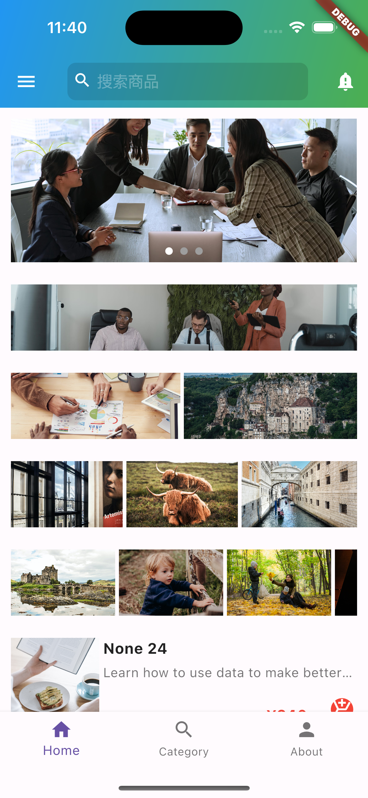
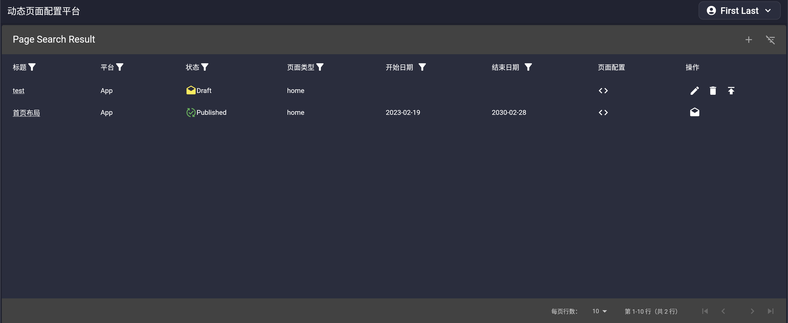
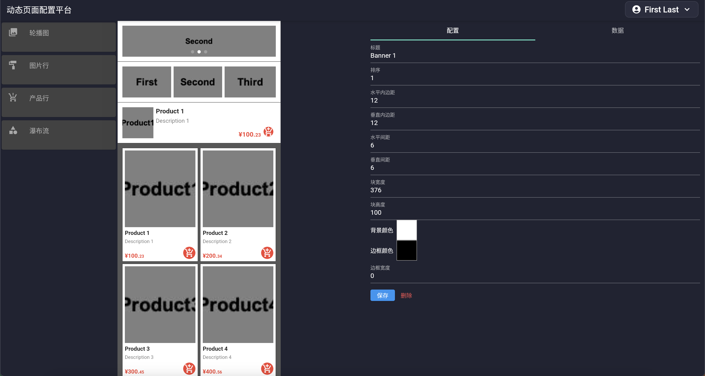
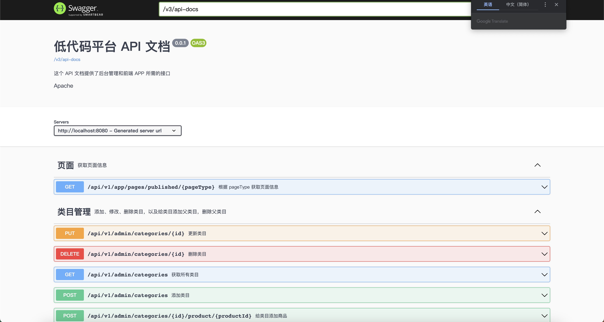

# 第一章

## 1. 为什么全栈技能很重要

全栈技能是指一个人能够同时掌握多个技能，比如前端、后端、移动端、数据库、运维等等。全栈技能的重要性在于，它可以让一个人在一个项目中同时承担多个角色，这样可以大大提高项目的开发效率。

从视野上来说，全栈技能可以让一个人更好地理解整个项目，从而更好地解决问题。你可以更好地理解前端的需求，从而更好地设计后端的接口；你可以更好地理解后端的需求，从而更好地设计前端的界面。

从个人发展角度来说，全栈技能可以让你在一个领域中更快地成长，因为不同的技术栈既有相通之处，也有不同之处，你可以从不同的技术栈中学习到不同的知识，从而更好地成长。而且当一种思想在某种框架中得到很好的体现，并得到用户的认可，你会发现其他框架也会借鉴这种思想，从而更好地发展自己。这使得一方面你在新的技术栈中会发现一些似曾相识的东西，另一方面你也可以更好地理解这些似曾相识的东西，这极大的提升了学习效率。当然，任何一个技术栈都有它的历史周期，当一个技术在开始衰落时，有全栈能力的你可以更快地转型到下一个技术栈中，从而更好地发展自己。

不同的技术栈的技能积累是不一样的，比如前端技能的积累主要是在 HTML、CSS、JavaScript、TypeScript、Vue、React、Angular 等技术栈中，后端技能的积累主要是在 Java、Python、Go、Node.js 等技术栈中，移动端技能的积累主要是在 Android、iOS、Flutter 等技术栈中，数据库技能的积累主要是在 MySQL、MongoDB、Redis 等技术栈中，运维技能的积累主要是在 Linux、Docker、Kubernetes 等技术栈中。

## 2. 课程介绍

本课程是一个以 Flutter 为前端技术栈，Java 为后端技术栈的全栈开发课程。我们预期读者是有一定前端或移动端编程基础的人，比如你已经掌握了 HTML、CSS、JavaScript、TypeScript、Vue、React、Angular 等技术栈中的一种或多种，或者你已经掌握了 Android、iOS、Flutter 等技术栈中的一种或多种。

你应该对面向对象的编程思想有一定的了解，以及对函数式编程有一定的了解，我们的课程不会过多地讲解面向对象的编程思想和函数式编程，而是会让你在实际的项目中去体会这些编程思想。如果你觉得对这些概念比较陌生，可以先去学习一些面向对象的编程思想和函数式编程的知识，慕课网中有我的 [《Angular 开发拼多多 WebApp－从基础到项目实战》](https://coding.imooc.com/class/336.html) 以及 [《JAVA 函数式编程》](https://www.imooc.com/learn/1284)，都是你可以参考的课程。

本课程的目标是让你掌握 Flutter、Java、MySQL、Docker 等技术栈，从而让你成为一个全栈开发工程师。本课程的内容包括：

- TODO
- TODO
- TODO

## 3. 课程结构

本课程的结构如下：

- 第一章：为什么全栈技能很重要

## 4. Flutter 简介

Flutter 是 Google 开源的移动 UI 框架，可以快速在 iOS 和 Android 上构建高质量的原生用户界面。Flutter 可以与现有的代码一起工作。在全世界，Flutter 正在被越来越多的开发者和组织使用，并且 Flutter 是完全免费、开源的。

## 4.1. Flutter 特性

fllutter 的特性如下：

- 快速开发
- 热重载
- 响应式 UI
- 跨平台
- 原生性能
- 富有表现力和灵活的 UI

### 4.2. Dart 语言

Flutter 的开发语言是 Dart。 Dart 是一种客户端-优先的语言，可以快速开发出高质量的产品，Dart 语言的特性如下：

- 一致的编程体验
- 快速开发
- 丰富的库
- 声明式 UI
- 异步编程
- 跨平台

Dart 在语法上与 Java、C#、JavaScript、Kotlin、Swift、TypeScript 等语言非常相似，因此，如果你已经熟悉这些语言中的任何一种，那么学习 Dart 语言将会非常容易。

### 4.3. 响应式 UI

Flutter 的 UI 是响应式的，这意味着当应用程序的状态发生变化时，Flutter 框架会自动更新 UI，这样可以避免手动更新 UI 的麻烦。

### 4.4. 跨平台

Flutter 可以在 iOS 和 Android 上运行，这意味着我们可以使用一套代码来同时开发 iOS 和 Android 应用程序。Flutter 现在还可以在 Windows、MacOS、Linux、Web 等平台上运行，但是这些平台的支持还不是很完善。

### 4.5. 原生性能

Flutter 使用了 Skia 2D 渲染引擎，这是 Google 在 Chrome 浏览器中使用的渲染引擎，它可以提供非常流畅的动画和 60fps 的渲染速度。

## 5. 需求分析

在这个课程中，我们将开发一个全栈应用，这个应用有几个部分构成：

- **Flutter App**：目标平台是 Android/iOS，我们将开发一个常见的 App 首页，这个首页是由一系列组件构成，包括轮播图，一行一张的图片，一行两张的图片，一行三张的图片，一行多张的图片，一行一个商品卡片，一行两个的商品卡片以及一个商品瀑布流。区别于一般 App 的是，这个首页是动态的，它的内容是从后端获取的，而不是写死在代码中的。这个应用的主要功能是展示我们后台的布局配置，所以我们不会做的太复杂，仅做演示目的。
    
  

- **Flutter Web 前端**：目标平台是 Web，这个前端是用于给运营人员操作的，运营人员可以通过这个前端来配置首页的布局，比如添加轮播图，添加一行一张的图片，添加一行两张的图片，添加一行三张的图片，添加一行多张的图片，添加一行一个商品卡片，添加一行两个的商品卡片以及添加一个商品瀑布流。这个前端的主要功能是让运营人员可以通过图形化的界面来配置首页的布局，而不是通过代码来配置。本质上是一个可视化的配置平台，也可以理解成一个简单的低代码平台。
    
  

- **Java 后端**：这个后端其实有两部分构成：

  - 一个是 App 后端接口，这个后端主要是用于给 Flutter App 提供接口，Flutter Web 前端通过这些接口来获取首页的布局配置。
  - 另一个是 Web 后台接口，这个后端主要是用于提供管理布局配置，以及更新首页的布局配置。

    
