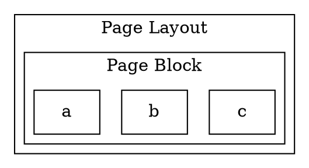

# 第一章

## 1. 为什么全栈技能很重要

全栈技能是指一个人能够同时掌握多个技能，比如前端、后端、移动端、数据库、运维等等。全栈技能的重要性在于，它可以让一个人在一个项目中同时承担多个角色，这样可以大大提高项目的开发效率。

从视野上来说，全栈技能可以让一个人更好地理解整个项目，从而更好地解决问题。你可以更好地理解前端的需求，从而更好地设计后端的接口；你可以更好地理解后端的需求，从而更好地设计前端的界面。

从个人发展角度来说，全栈技能可以让你在一个领域中更快地成长，因为不同的技术栈既有相通之处，也有不同之处，你可以从不同的技术栈中学习到不同的知识，从而更好地成长。而且当一种思想在某种框架中得到很好的体现，并得到用户的认可，你会发现其他框架也会借鉴这种思想，从而更好地发展自己。这使得一方面你在新的技术栈中会发现一些似曾相识的东西，另一方面你也可以更好地理解这些似曾相识的东西，这极大的提升了学习效率。当然，任何一个技术栈都有它的历史周期，当一个技术在开始衰落时，有全栈能力的你可以更快地转型到下一个技术栈中，从而更好地发展自己。

不同的技术栈的技能积累是不一样的，比如前端技能的积累主要是在 HTML、CSS、JavaScript、TypeScript、Vue、React、Angular 等技术栈中，后端技能的积累主要是在 Java、Python、Go、Node.js 等技术栈中，移动端技能的积累主要是在 Android、iOS、Flutter 等技术栈中，数据库技能的积累主要是在 MySQL、MongoDB、Redis 等技术栈中，运维技能的积累主要是在 Linux、Docker、Kubernetes 等技术栈中。

## 2. 课程介绍

本课程是一个以 Flutter 为前端技术栈，Java 为后端技术栈的全栈开发课程。我们预期读者是有一定前端或移动端编程基础的人，比如你已经掌握了 HTML、CSS、JavaScript、TypeScript、Vue、React、Angular 等技术栈中的一种或多种，或者你已经掌握了 Android、iOS、Flutter 等技术栈中的一种或多种。

你应该对面向对象的编程思想有一定的了解，以及对函数式编程有一定的了解，我们的课程不会过多地讲解面向对象的编程思想和函数式编程，而是会让你在实际的项目中去体会这些编程思想。如果你觉得对这些概念比较陌生，可以先去学习一些面向对象的编程思想和函数式编程的知识，慕课网中有我的 [《Angular 开发拼多多 WebApp－从基础到项目实战》](https://coding.imooc.com/class/336.html) 以及 [《JAVA 函数式编程》](https://www.imooc.com/learn/1284)，都是你可以参考的课程。

本课程的目标是让你掌握 Flutter、Java、MySQL、Docker 等技术栈，从而让你成为一个全栈开发工程师。本课程的内容包括：

- TODO
- TODO
- TODO

## 3. 课程结构

本课程的结构如下：

- 第一章：为什么全栈技能很重要

## 4. Flutter 简介

Flutter 是 Google 开源的移动 UI 框架，可以快速在 iOS 和 Android 上构建高质量的原生用户界面。Flutter 可以与现有的代码一起工作。在全世界，Flutter 正在被越来越多的开发者和组织使用，并且 Flutter 是完全免费、开源的。

## 4.1. Flutter 特性

fllutter 的特性如下：

- 快速开发
- 热重载
- 响应式 UI
- 跨平台
- 原生性能
- 富有表现力和灵活的 UI

### 4.2. Dart 语言

Flutter 的开发语言是 Dart。 Dart 是一种客户端-优先的语言，可以快速开发出高质量的产品，Dart 语言的特性如下：

- 一致的编程体验
- 快速开发
- 丰富的库
- 声明式 UI
- 异步编程
- 跨平台

Dart 在语法上与 Java、C#、JavaScript、Kotlin、Swift、TypeScript 等语言非常相似，因此，如果你已经熟悉这些语言中的任何一种，那么学习 Dart 语言将会非常容易。

### 4.3. 响应式 UI

Flutter 的 UI 是响应式的，这意味着当应用程序的状态发生变化时，Flutter 框架会自动更新 UI，这样可以避免手动更新 UI 的麻烦。

我们可以用一个简单的例子说明 Flutter 的响应式 UI 特性。假设我们有一个计数器应用程序，它有一个按钮和一个文本，当我们点击按钮时，文本的值会自动增加。在 Flutter 中，我们可以这样实现：

```dart
class MyApp extends StatelessWidget {
  @override
  Widget build(BuildContext context) {
    return MaterialApp(
      title: 'Flutter Demo',
      theme: ThemeData(
        primarySwatch: Colors.blue,
      ),
      home: MyHomePage(title: 'Flutter Demo Home Page'),
    );
  }
}

class MyHomePage extends StatefulWidget {
  MyHomePage({Key key, this.title}) : super(key: key);

  final String title;

  @override
  State<MyHomePage> createState() => _MyHomePageState();
}

class _MyHomePageState extends State<MyHomePage> {
  int _counter = 0;

  void _incrementCounter() {
    setState(() {
      _counter++;
    });
  }

  @override
  Widget build(BuildContext context) {
    return Scaffold(
      appBar: AppBar(
        title: Text(widget.title),
      ),
      body: Center(
        child: Column(
          mainAxisAlignment: MainAxisAlignment.center,
          children: <Widget>[
            Text(
              'You have pushed the button this many times:',
            ),
            Text(
              '$_counter',
              style: Theme.of(context).textTheme.headline4,
            ),
          ],
        ),
      ),
      floatingActionButton: FloatingActionButton(
        onPressed: _incrementCounter,
        tooltip: 'Increment',
        child: Icon(Icons.add),
      ),
    );
  }
}
```

在上面的代码中，我们使用了一个 StatefulWidget，这个 StatefulWidget 有一个状态，这个状态中有一个计数器，当我们点击按钮时，计数器的值会自动增加，这个计数器的值会自动更新到 UI 中。其中 setState 方法会通知 Flutter 框架，有状态发生了变化，Flutter 框架会自动调用 build 方法来更新 UI。

需要指出的是，每次 setState 方法被调用时，Flutter 框架都会重新调用 build 方法来更新 UI，这意味着我们不需要手动更新 UI，这样可以大大提高开发效率。但是，这也意味着我们不能在 build 方法中执行耗时的操作，因为每次 setState 方法被调用时，Flutter 框架都会重新调用 build 方法来更新 UI，如果在 build 方法中执行耗时的操作，那么 UI 将会卡顿。

在 App 的开发框架中，这种行为很像 React/Vue 中的响应式 UI。因此，如果你已经熟悉 React/Vue，那么学习 Flutter 将会非常容易。当然现在在 Android/iOS 官方的原生开发框架也有受 React/Vue 启发的响应式 UI 框架，比如 Android Jetpack Compose 和 iOS SwiftUI。学习了 Flutter，你将会发现学习 Android Jetpack Compose 和 iOS SwiftUI 将会非常容易。

### 4.4. 跨平台

Flutter 可以在 iOS 和 Android 上运行，这意味着我们可以使用一套代码来同时开发 iOS 和 Android 应用程序。Flutter 现在还可以在 Windows、MacOS、Linux、Web 等平台上运行，但是这些平台的支持还不是很完善。

Flutter 的跨平台特性是通过 Flutter Engine 实现的，Flutter Engine 是一个高性能的渲染引擎，它可以直接将 Flutter UI 绘制到设备屏幕上，而不需要经过中间层。Flutter Engine 也可以与现有的代码一起工作，这意味着我们可以在 Flutter 中使用原生的平台代码。

如果我们使用命令行创建一个 Flutter 项目，那么 Flutter 会自动为我们创建一个 Android 项目和一个 iOS 项目，这两个项目都是使用原生的 Android/iOS 代码来实现的。Flutter 会将 Flutter 代码编译成原生的 Android/iOS 代码，然后将编译后的原生代码集成到 Android/iOS 项目中。这样，我们就可以使用一套代码来同时开发 iOS 和 Android 应用程序了。

### 4.5. 原生性能

Flutter 使用了 Flutter Engine，这是一个高性能的渲染引擎，它可以直接将 Flutter UI 绘制到设备屏幕上，而不需要经过中间层。Flutter Engine 也可以与现有的代码一起工作，这意味着我们可以在 Flutter 中使用原生的平台代码。

Flutter Engine 使用了 Dart VM，Dart VM 是一个高性能的虚拟机，它可以直接将 Dart 代码编译成原生的机器码，而不需要经过中间层。

Flutter Engine 和 Dart VM 都是使用 C++ 语言实现的，这意味着 Flutter 和 Dart 都是原生的，它们的性能是非常高的。

### 4.6. 热重载

在 Flutter 中，我们可以在不重新启动应用的情况下，实时更新应用的 UI。这意味着我们可以在开发过程中，不断地修改代码，然后 Flutter 框架会自动重新编译代码，并将编译后的代码热重载到应用中，这样我们就可以在不重新启动应用的情况下，实时更新应用的 UI。

这种热重载的特性是通过 Flutter Engine 实现的，Flutter Engine 会监听文件系统的变化，当文件系统发生变化时，Flutter Engine 会自动重新编译代码，并将编译后的代码热重载到应用中。

其机制和 React/Vue 中的热重载机制是一样的，都是通过监听文件系统的变化来实现的。

### 4.7. 声明式 UI

声明式 UI 是一种用户界面编程模式，其中开发人员声明应该显示什么，而不是编写代码来指定应该如何显示。它是一种与命令式编程相对的编程模式。

在声明式 UI 中，开发人员定义了应该显示的内容、布局和交互，但不指定实现的方式。相反，它们使用某种类型的描述性语言（如 XML、JSON 或 Flutter 的 Widget 树）来表示用户界面，将这些描述传递给框架或库，并由框架或库负责创建实际的用户界面。

例如，当使用 Flutter 编写声明式 UI 时，开发人员使用 Widget 树来描述用户界面。Widget 树是一个由嵌套 Widget 组成的层次结构，每个 Widget 都描述了用户界面的一部分，如文本、按钮、图像、容器等。当开发人员更改 Widget 树时，Flutter 框架会自动重新构建用户界面以反映这些更改。开发人员不必关心如何创建、排列或呈现小部件。相反，他们可以专注于声明用户界面应该是什么样子，框架会负责实现。

声明式 UI 的优点包括：

- 代码更容易理解和维护，因为代码更加清晰、简洁和可读。
- 更容易进行跨平台开发，因为相同的代码可以用于多个平台。
- 更容易进行测试，因为 UI 的状态可以更容易地检查和验证。
- 更容易进行迭代和重构，因为 UI 可以在不影响应用程序的功能的情况下更改和重新设计。

因此，声明式 UI 是现代应用程序开发中非常流行的一种编程模式。

## 5. 需求分析

在这个课程中，我们将开发一个全栈应用，这个应用有几个部分构成：

- **Flutter App**：目标平台是 Android/iOS，我们将开发一个常见的 App 首页，这个首页是由一系列组件构成，包括轮播图，一行一张的图片，一行两张的图片，一行三张的图片，一行多张的图片，一行一个商品卡片，一行两个的商品卡片以及一个商品瀑布流。区别于一般 App 的是，这个首页是动态的，它的内容是从后端获取的，而不是写死在代码中的。这个应用的主要功能是展示我们后台的布局配置，所以我们不会做的太复杂，仅做演示目的。
    
  

- **Flutter Web 前端**：目标平台是 Web，这个前端是用于给运营人员操作的，运营人员可以通过这个前端来配置首页的布局，比如添加轮播图，添加一行一张的图片，添加一行两张的图片，添加一行三张的图片，添加一行多张的图片，添加一行一个商品卡片，添加一行两个的商品卡片以及添加商品瀑布流。这个前端的主要功能是让运营人员可以通过图形化的界面来配置首页的布局，而不是通过代码来配置。本质上是一个可视化的配置平台，也可以理解成一个简单的低代码平台。
    
  

- **Java 后端**：这个后端其实有两部分构成：

  - 一个是 App 后端接口，这个后端主要是用于给 Flutter App 提供接口，Flutter Web 前端通过这些接口来获取首页的布局配置。
  - 另一个是 Web 后台接口，这个后端主要是用于提供管理布局配置，以及更新首页的布局配置。

    

### 5.1. 需求的来源

在做需求分析的时候，第一步是要确定需求的来源，也就是要确定需求是从哪里来的。这个过程往往需要和不同的人进行沟通，比如和产品经理、项目经理、UI 设计师、运营人员等进行沟通，确定需求的来源。

一般来说一个需求的提出会有一个主导方，但这个主导方往往不一定能清晰的描述自己的需求，所以我们需要和他们进行沟通，了解他们的需求，然后再进行需求分析。而且需求往往会有隐含的参与者，有时这些参与者不那么明显，我们需要通过梳理需求找到这些参与者。

在这个课程中，我们的需求是来自于运营人员，他们需要一个可视化的界面来配置首页的布局，而不是通过代码来配置。这个需求的来源是运营人员。让我们第一次接触这个需求的时候，可能认为运营人员是唯一的参与者，但是实际上，这个需求还有隐含的参与者，那就是开发人员。这个需求需要 App 的开发者的配合，他们需要获得我们的布局配置，然后根据我们的布局配置来开发 App。接下来你会发现，App 的开发者需要接口，而这个接口就是我们的后端提供的。而可视化的界面同样需要前端和后端的配合，前端需要提供界面，后端需要提供接口。所以这个需求的参与者不仅仅是运营人员，还有 App 的开发者，还有前端的开发者，还有后端的开发者。

当然还有一种参与者，并非具体的人，比如我们的用户。我们的用户是最终的使用者，他们需要一个好用的 App，而这个好用的 App，就是我们的 App。所以我们的需求不仅仅是为了满足运营人员的需求，也是为了满足用户的需求。比如公司的技术要求，如果公司要求保证首页的渲染效率，那么我们的需求就需要满足这个要求，这涉及到你要采用哪些方案来实现你的需求，比如 HTML 这时候可能就不太合适。再有需要考虑的就是国家的法律法规，比如国家的法律法规要求对用户数据需要进行加密，那么我们的需求就需要满足这个要求。

所有参与方都需要参与到需求分析的过程中，这样才能保证我们的需求是正确的，是能够满足所有参与者的需求的。

对于我们的课程来说，必须做一些必要的假定，因为我们并没有真正的运营人员，也没有真正的 App 的开发者，也没有真正的前端的开发者，也没有真正的后端的开发者，所以我们需要做一些必要的假定。

- **运营人员**：我们假定运营人员是一个没有技术基础的人，他可以通过可视化的界面来配置首页的布局，但是他不会编写代码。而且他也不能接受太繁琐的配置步骤，比如太多的参数需要配置，太多的步骤需要操作，这样他就会觉得很繁琐，不愿意去配置。他的首要目的是想要快速的配置出一个在指定时间内可以上线的首页，而不是想要一个在线页面编辑器。
- **首页性能**：我们假定公司对于首页性能有较高的要求，所以我们的技术选择需要考虑到这一点。

### 5.2. 需求梳理

一般来说，我们在国内很少会从用户处直接得到完善的需求文档，所以我们需要从运营人员那里得到需求，然后再进行需求梳理，梳理出完整的需求文档。

在做需求分析的时候，第一步是要确定需求的范围，也就是要确定我们要做什么，不要做什么。这个过程往往需要和不同的人进行沟通，比如和产品经理、项目经理、UI 设计师、运营人员等进行沟通，确定我们要做什么，不要做什么。

在这个课程中，由于我们没法直接接触真正的运营人员，或前端，后端的开发人员或产品经理等角色，所以我这里会根据我自己的个人经验，来先梳理出一个框架：

- 需求 1：运营人员可以通过可视化的界面来配置首页的布局
- 需求 2：首页的布局是有生效时间段的，比如 2020-01-01 00:00:00 到 2020-01-02 00:00:00
- 需求 3：首页的布局可以有多个，因为不同的时间段，首页的布局可能是不一样的
- 需求 4：首页的布局可以有几个状态，比如草稿、已发布、已下线
- 需求 5：相同或者重叠的时间段，只能有一个布局是已发布的，因为 App 只能展示一个布局
- 需求 6：App 获取的布局是当前时间段的已发布的布局，如果当前时间段没有布局，那么 App 获取的是最近的一个布局
  - 需要思考的是，如果当前时间段没有布局，那么 App 获取的是最近的一个布局，那么这个最近的布局是什么？是最近的已发布的布局，还是最近的任意布局？如果还是没有布局，那么 App 获取的是什么？也就是如何兜底？这其实是一个隐含的需求，需要我们思考。
- 需求 7：运营人员不能接受太繁琐的配置步骤，比如太多的参数需要配置，太多的步骤需要操作。
- 需求 8：运营人员可以创建/编辑/删除布局
- 需求 9：运营人员可以按条件查询布局
- 需求 10：运营人员可以发布/下线布局
- 需求 11：一个用于 demo 的 App，可以获取到配置的布局

### 5.3. 需求分解

上面这些需求只是一个骨架，还需要进一步细化，比如需求 1。但在细化之前我们必须先确定需求的范围，也就是要确定我们要做什么，不要做什么。这个过程往往需要和不同的人进行沟通，比如和产品经理、项目经理、UI 设计师、运营人员等进行沟通，确定我们要做什么，不要做什么。而且这个需求还和可能方案有关，涉及到我们如何设计这个可视化的配置。

那么经过和运营人员的交流，我们了解到运营人员的想法是，他希望有一个可视化的界面，可以通过拖拽的方式来配置布局，而且他希望所见即所得。一般来说他希望能使用类似盖楼的方式来配置布局，比如，第一层是轮播图，第二层是一张图片，第三层是两个商品等等。

这个想法你仔细思考的话，其实包含了很多待进一步确定的细节，比如：

- 盖楼的话需要如何界定一层？
- 一层里面可以放什么？
- 一层看成一个组件还是多个组件？
- 如果一层是一个组件，那么这个组件需要有哪些可配置属性？
- 如果一层是多个组件，那么这些组件之间的关系是什么？
- 一层里面的组件如何排序？
- 需要支持哪些组件？
- 这些组件最终要绑定具体的数据，那么数据是从哪里来的？比如轮播图的图片以及点上去的跳转链接是从哪里来的？
- 是否需要对整个布局进行某些参数的配置？

这些细节都需要进一步确定，然后再进行需求分解。

这一步的细节沟通你要拉上 UI 设计师，产品经理，运营人员等人，因为这些细节涉及到我们的技术选型，也涉及到我们的设计，所以需要和他们进行沟通。

在梳理需求的时候，这种沟通会非常频繁，所以你要有耐心，不要急于动手，因为这一步的沟通是非常重要的，如果这一步做不好，后面的开发就会非常困难。

这时候，为了大家能在同一理解上继续讨论，我们需要定义一些概念，比如：

- 布局：一个布局就是一个页面，比如首页、商品详情页等等
- 区块：一个区块就是一个矩形区域，比如轮播图、一张图片、两个商品等等

为了说清楚布局和区块的概念，我们先来看一下一个布局的示意图：



有了这样的概念之后，我们进一步讨论了。页面级别和区块级别的配置是不一样的，比如页面级别的配置就是例如整个页面的背景色，内边距等等，而区块级别的配置就是 `Page Block` 中的配置，比如内边距，边框颜色等等。

- 需求 1：运营人员可以通过可视化的界面来配置首页的布局
  - 需求 1.1: 页面布局是由一个个区块组成的
    - 需求 1.1.1: 区块的定义就是一个包括内边距的矩形区域
    - 需求 1.1.2: 区块种类分为：图片行，轮播图，商品行，以及商品瀑布流
    - 需求 1.1.3: 图片行可以放一张图片，也可以放多张图片
      - 需求 1.1.3.1: 图片行中的图片是可以配置图片的链接以及点击跳转的链接
      - 需求 1.1.3.2: 多于 3 张图片时，会形成可横向滑动的列表效果
      - 需求 1.1.3.3:
    - 需求 1.1.4: 轮播图可以多张图片，
- 需求 2：首页的布局是有生效时间段的，比如 2020-01-01 00:00:00 到 2020-01-02 00:00:00
- 需求 3：首页的布局可以有多个，因为不同的时间段，首页的布局可能是不一样的
- 需求 4：首页的布局可以有几个状态，比如草稿、已发布、已下线
- 需求 5：相同或者重叠的时间段，只能有一个布局是已发布的，因为 App 只能展示一个布局
- 需求 6：App 获取的布局是当前时间段的已发布的布局，如果当前时间段没有布局，那么 App 获取的是最近的一个布局
  - 需要思考的是，如果当前时间段没有布局，那么 App 获取的是最近的一个布局，那么这个最近的布局是什么？是最近的已发布的布局，还是最近的任意布局？如果还是没有布局，那么 App 获取的是什么？也就是如何兜底？这其实是一个隐含的需求，需要我们思考。
- 需求 7：运营人员不能接受太繁琐的配置步骤，比如太多的参数需要配置，太多的步骤需要操作。
- 需求 8：运营人员可以创建/编辑/删除布局
- 需求 9：运营人员可以按条件查询布局
- 需求 10：运营人员可以发布/下线布局
- 需求 11：一个用于 demo 的 App，可以获取到配置的布局
