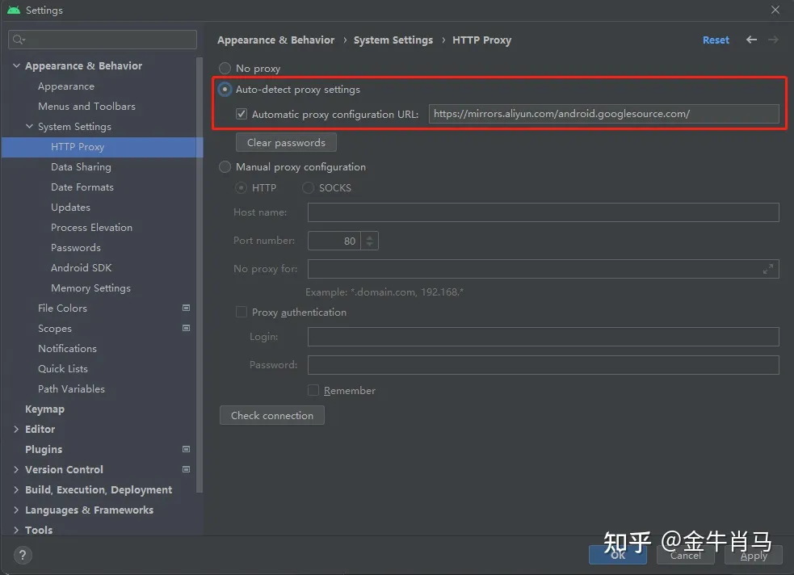
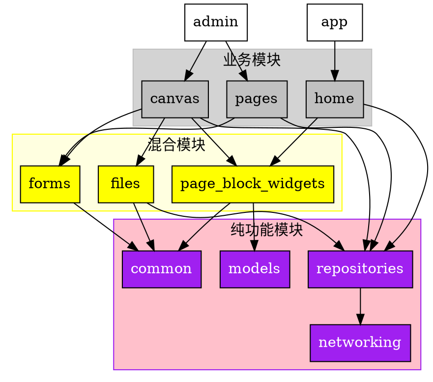

# 环境搭建和项目介绍

<!-- @import "[TOC]" {cmd="toc" depthFrom=1 depthTo=6 orderedList=false} -->

<!-- code_chunk_output -->

- [环境搭建和项目介绍](#环境搭建和项目介绍)
  - [1. 环境搭建](#1-环境搭建)
  - [2. 创建第一个 Flutter 应用](#2-创建第一个-flutter-应用)
    - [2.1. Flutter 应用结构](#21-flutter-应用结构)
  - [3. 项目结构](#3-项目结构)
    - [3.1. 项目结构](#31-项目结构)
    - [3.2.2 工程搭建](#322-工程搭建)
    - [3.2.3 依赖管理](#323-依赖管理)
      - [admin 工程](#admin-工程)
      - [app 工程](#app-工程)

<!-- /code_chunk_output -->

## 1. 环境搭建

如果有条件，可以遵循 [官方文档](https://flutter.dev/docs/get-started/install) 进行安装，如果没有条件，可以使用 [flutter.cn](https://flutter.cn/docs/get-started/install) 提供的镜像进行安装。

- 下载 Flutter SDK

  - [Flutter SDK](https://docs.flutter.dev/get-started/install)

- 解压到指定目录

  - `D:\flutter` (Windows)
  - `/Users/username/flutter` (MacOS)
  - `/home/username/flutter` (Linux)

- 配置环境变量 PATH

  - 打开系统环境变量配置界面，添加 Flutter SDK 的 bin 目录到 PATH 环境变量中，比如 `D:\flutter\bin` (Windows)
  - 打开 `~/.bash_profile` 文件，添加 Flutter SDK 的 bin 目录到 PATH 环境变量中，比如 `/Users/username/flutter/bin` (MacOS)
  - 打开 `~/.bashrc` 文件，添加 Flutter SDK 的 bin 目录到 PATH 环境变量中，比如 `/home/username/flutter/bin` (Linux)

- 配置国内镜像

  - Linux/MacOS:

    - 打开 `~/.bash_profile` 文件，添加如下内容

      ```bash
      export PUB_HOSTED_URL=https://pub.flutter-io.cn
      export FLUTTER_STORAGE_BASE_URL=https://storage.flutter-io.cn
      ```

    - 执行 `source ~/.bash_profile` 命令，使配置生效

  - windows 11:

    - 在环境变量中添加 `PUB_HOSTED_URL` 和 `FLUTTER_STORAGE_BASE_URL` 变量，值分别为 `https://pub.flutter-io.cn` 和 `https://storage.flutter-io.cn`

- 安装 Android Studio

  - [Android Studio](https://developer.android.google.cn/studio/index.html)

  - 其中 `Android Studio` 如果无法安装，可以使用 [Android Studio 中国镜像](https://developer.android.google.cn/studio/index.html) 进行安装，如果还不行，只能大家在学习的 QQ 群中互助一下了。

  - 安装完 `Android Studio` 后，还需要安装 `Android SDK` ，同样的，我们需要设置 `Android SDK` 中国镜像，否则会很慢。
    

  - 如图红框标注位置，填入国内源地址 [阿里云镜像](https://mirrors.aliyun.com/android.googlesource.com/) 后点 `Apply` 或 `OK` 键。

  - 然后点击 `SDK Tools` 标签，勾选 `Android SDK Build-Tools` 和 `Android SDK Platform-Tools` 两项，然后点击 `Apply` 或 `OK` 键。

  - 选择 `Android SDK` 的版本，点击 `Apply` 或 `OK` 键。

  - 接下来需要创建一个 `Android Virtual Device` ，点击 `AVD Manager` 标签，点击 `Create Virtual Device` 按钮，选择 `Phone` 类型，然后选择 `Pixel 2`，点击 `Next` 按钮，选择一个 Android 版本，点击 `Next` 按钮，选择 `Q`，点击 `Finish` 按钮。

  - 安装插件

    - 打开 `Android Studio`，点击左下角的扩展图标，搜索 `Flutter` 插件，安装即可。

    - 如果安装过程中出现问题，可以参考 [Android Studio 安装 Flutter 插件](https://flutter.cn/docs/get-started/editor?tab=androidstudio#androidstudio) 进行安装。

- 安装 Xcode

  - [Xcode](https://developer.apple.com/xcode/)

  - 使用 `mac` 的同学，如果想使用 `iPhone` 模拟器，需要安装 `Xcode` ， 这个就不用多说了。

- 安装 Chrome

  - [Chrome](https://www.google.cn/chrome/)

- 安装 VSCode

  - [VSCode](https://code.visualstudio.com/)

  - 安装 `VSCode` 后，需要安装 `Dart` 和 `Flutter` 插件，安装方法如下：

    - 打开 `VSCode`，点击左下角的扩展图标，搜索 `Dart` 和 `Flutter` 插件，安装即可。

    - 如果安装过程中出现问题，可以参考 [VSCode 安装 Dart 和 Flutter 插件](https://flutter.cn/docs/get-started/editor?tab=vscode#vscode) 进行安装。

- 验证安装

  - 打开终端，输入 `flutter doctor`，如果出现如下内容，说明安装成功

  ```bash
  Doctor summary (to see all details, run flutter doctor -v):
  [✓] Flutter (Channel stable, 3.7.8, on macOS 13.2.1 22D68 darwin-arm64, locale zh-Hans-CN)
  [✓] Android toolchain - develop for Android devices (Android SDK version 33.0.1)
  [✓] Xcode - develop for iOS and macOS (Xcode 14.2)
  [✓] Chrome - develop for the web
  [✓] Android Studio (version 2022.1)
  [✓] IntelliJ IDEA Ultimate Edition (version 2022.3.3)
  [✓] VS Code (version 1.76.2)
  [✓] Connected device (3 available)
  [✓] HTTP Host Availability

  • No issues found!
  ```

Flutter 团队会经常更新 Flutter SDK，所以我们需要定期升级 Flutter SDK。升级也很简单，只需要执行 `flutter upgrade` 命令即可。

## 2. 创建第一个 Flutter 应用

- 使用命令行创建

  - 打开终端，输入 `flutter create myapp`，创建一个名为 `myapp` 的 Flutter 应用。

  - 进入 `myapp` 目录，输入 `flutter run`，运行应用。

  - 如果出现如下内容，说明运行成功

    ```bash
    Running "flutter pub get" in myapp...                         1,1s
    Launching lib/main.dart on Chrome in debug mode...
    lib/main.dart:1
    ```

- 使用 Android Studio 创建

  - 打开 `Android Studio`，点击 `Start a new Flutter project` 按钮，选择 `Flutter Application`，点击 `Next` 按钮。

  - 填写项目名称，点击 `Next` 按钮。

  - 填写项目描述，点击 `Next` 按钮。

  - 填写项目路径，点击 `Finish` 按钮。

  - 等待项目创建完成，点击 `Run` 按钮，运行应用。

  - 如果出现如下内容，说明运行成功

    ```bash
    Running "flutter pub get" in myapp...                         1,1s
    Launching lib/main.dart on Chrome in debug mode...
    lib/main.dart:1
    ```

### 2.1. Flutter 应用结构

- `lib` 目录

  - `lib` 目录是 Flutter 应用的主要目录，所有的 Dart 代码都在这个目录下。

  - `lib` 目录下的 `main.dart` 文件是 Flutter 应用的入口文件。

- `pubspec.yaml` 文件

  - `pubspec.yaml` 文件是 Flutter 应用的配置文件，里面包含了应用的名称、描述、依赖等信息。

  - `pubspec.yaml` 文件中的 `dependencies` 字段是应用的依赖，这里面的依赖都是从 [pub.dev](https://pub.dev/) 上下载的。

  - `pubspec.yaml` 文件中的 `dev_dependencies` 字段是开发依赖，这里面的依赖都是从 [pub.dev](https://pub.dev/) 上下载的。

  - `pubspec.yaml` 文件中的 `flutter` 字段是 Flutter 的配置。

## 3. 项目结构

我们的前端项目从大的方面来说可以分为两个部分：

- 给运营人员使用的后台管理系统

- 给用户使用的移动端应用

但由于两个大的部分都是基于 Flutter 开发的，而且有相当的可复用性，所以我们采用了多模块的方式来进行开发，这样可以让我们的代码更加的清晰，也可以让我们的开发更加的高效。

### 3.1. 项目结构

项目模块的拆分方式一般有两种：

- 按照功能模块拆分：比如 `common` 模块、`models` 模块、`repositories` 模块等等

- 按照业务模块拆分：比如 `home` 模块、`pages` 模块、`files` 模块等等

我们的项目采用的是混合的方式，按照功能模块拆分的同时，也按照业务模块拆分，这样可以让我们的项目更加的清晰。具体来说，我们的项目结构如下：

```bash
├── admin
│   ├── lib
│   │   ├── main.dart
│   │   ├── routes
│   │   ├── widgets
├── app
│   ├── lib
│   │   ├── main.dart
├── canvas
│   ├── lib
│   │   ├── canvas.dart
├── common
│   ├── lib
│   │   ├── common.dart
├── files
│   ├── lib
│   │   ├── files.dart
├── forms
│   ├── lib
│   │   ├── forms.dart
├── home
│   ├── lib
│   │   ├── home.dart
├── models
│   ├── lib
│   │   ├── models.dart
├── networking
│   ├── lib
│   │   ├── networking.dart
├── page_block_widgets
│   ├── lib
│   │   ├── page_block_widgets.dart
├── pages
│   ├── lib
│   │   ├── pages.dart
├── repositories
│   ├── lib
│   │   ├── repositories.dart
```

其中，

- `admin` 模块是给运营人员使用的后台管理系统，它直接依赖了 `canvas` 模块和 `pages` 模块，这其实是两个大的管理后台页面。所以 `canvas` 模块和 `pages` 模块是按照业务模块拆分的。
- `app` 模块是给用户使用的移动端应用，它直接依赖了 `home` 模块，这其实是用户的首页。所以 `home` 模块是按照业务模块拆分的。当然真正的移动端会有更多业务模块，但我们的项目只做了首页，所以我们只拆分了 `home` 模块。
- `canvas` 模块是画布模块，它直接依赖了 `page_block_widgets` 模块，这其实是画布上的组件。所以 `page_block_widgets` 模块是按照业务模块拆分的。由于画布模块和首页模块都会用到相同的组件，所以我们把它拆分出来，形成 `page_block_widgets` 模块，这样可以让我们的代码更加的清晰。而其中属性的修改依赖了 `models` 模块和 `forms` 模块。数据操作依赖了 `repositories` 模块和 `networking` 模块。在图片的数据操作上依赖了 `files` 模块。
- `common` 模块是公共模块，里面主要是一些公共的工具和扩展。注意不要让它变得臃肿，因为它是所有模块都会依赖的，所以它的代码量一定要控制在最小。几乎所有的模块都会依赖它。
- `files` 模块是文件模块，这个模块其实是封装了文件列表和文件上传的功能，它直接依赖了 `models` 模块和 `networking` 模块，这其实是文件列表和文件上传的数据模型和网络请求。所以 `models` 模块和 `networking` 模块是按照功能模块拆分的。
- `forms` 模块是表单模块，这里我们封装了一些自定义的表单组件以及定义了我们的通用验证规则。
- `home` 模块是首页模块，一般 App 也不止一个页面，所以理论上应该存在多个模块，但这里我们课程重点不在移动端，所以我们只做了一个首页模块。首页模块直接依赖了 `page_block_widgets` 模块，这其实是首页上的组件。
- `models` 模块是模型模块，也就是我们大部分的数据模型都在这里定义。这里我们封装了一些自定义的数据模型，比如 `Page`、`PageBlock`、`BlockData` 等等。
- `networking` 模块是网络模块，在这个模块里面我们封装了一些网络请求的工具，比如 `dio` 的拦截器、`dio` 的配置等等。
- `page_block_widgets` 模块是页面块模块，首页显示的区块都是这里定义的。这里我们封装了一些自定义的页面块组件，比如轮播图，图片行，产品行，瀑布流等等。
- `pages` 模块是页面模块，这里我们封装了一些自定义的页面组件，比如 `Page`、`PageHeader`、`PageBody`、`PageFooter` 等等。其中表单部分依赖了 `forms` 模块，数据操作部分依赖了 `repositories` 模块。
- `repositories` 模块是仓库模块，这里我们应用了 Repository 设计模式，它直接依赖了 `models` 模块和 `networking` 模块，这其实是仓库模块的数据模型和网络请求。所以 `models` 模块和 `networking` 模块是按照功能模块拆分的。

我们的项目结构图如下：



### 3.2.2 工程搭建

我们的工程搭建主要是搭建 `admin` 和 `app` 两个工程，这里我们使用 `flutter create` 命令来创建工程。为了以后便于管理，请先创建一个 `lowcode` 文件夹，然后在 `lowcode` 文件夹下创建 `frontend` 子文件夹。然后在这个目录下打开终端，执行下面的命令。注意要限定目标平台， app 端是 `android` 和 `iOS`， admin 端是 `web`。

```bash
flutter create --template=app admin --platforms=web
flutter create --template=app app --platforms=android,ios
```

限定目标平台之后，生成的工程就只包含了对应平台的代码，这样可以减少工程体积。以后如果要添加其他平台的支持，可以通过命令行添加。

```bash
# 比如给当前目录下的工程添加 web 平台支持
flutter create --platforms=web .
```

然后我们把上面说的各个模块都创建出来，这里我们使用 `flutter create` 命令来创建模块。

```bash
flutter create --template=package canvas
flutter create --template=package common
flutter create --template=package files
flutter create --template=package forms
flutter create --template=package home
flutter create --template=package models
flutter create --template=package networking
flutter create --template=package page_block_widgets
flutter create --template=package pages
flutter create --template=package repositories
```

### 3.2.3 依赖管理

#### admin 工程

我们的工程依赖管理主要是使用 `pubspec.yaml` 文件来管理依赖。我们先来看一下 `admin` 工程的 `pubspec.yaml` 文件。注意由于我们使用了本地包依赖，而不是发布到 `pub.dev`，所以我们需要在 `pubspec.yaml` 文件中添加 `publish_to: "none"`，这样就不会发布到 `pub.dev`。

```yml
name: admin
description: 后台管理界面

# 这个值设置为 "none" 表示不发布到 pub.dev
# 可以使用 path 依赖，这样可以直接修改依赖的模块代码，不用重新发布
# 如果要发布到 `pub.dev`，可以把这行删掉，然后执行 `flutter pub publish` 命令发布
publish_to: "none"

version: 1.0.0+1

environment:
  sdk: ">=2.19.4 <3.0.0"
  flutter: ">=3.7.0"

dependencies:
  flutter:
    sdk: flutter
  flutter_localizations:
    sdk: flutter
  cupertino_icons: ^1.0.2

  # 本地包依赖
  common:
    path: ../common
  canvas:
    path: ../canvas
  pages:
    path: ../pages

dev_dependencies:
  flutter_test:
    sdk: flutter

  flutter_lints: ^2.0.0

flutter:
  uses-material-design: true

  assets:
    - assets/images/
```

本地包依赖的路径是相对于 `pubspec.yaml` 文件的路径，所以我们使用 `../` 来表示上一级目录。这样我们就可以在 `admin` 工程中使用 `common`、`canvas`、`pages` 这三个模块了。

#### app 工程

`app` 工程的 `pubspec.yaml` 文件也是类似的，我们不详细讲解，这里贴出。

```yml
name: app
description: App 演示

publish_to: "none"
version: 1.0.0+1

environment:
  sdk: ">=2.19.4 <3.0.0"
  flutter: ">=3.7.0"

dependencies:
  flutter:
    sdk: flutter
  provider: ^6.0.5
  dio: ^5.0.2
  flutter_bloc: ^8.1.2
  # 本地包依赖
  home:
    path: ../home

  cupertino_icons: ^1.0.2

dev_dependencies:
  flutter_test:
    sdk: flutter

  flutter_lints: ^2.0.0
  network_image_mock: ^2.1.1
  bloc_test: ^9.1.1
  mocktail: ^0.3.0

flutter:
  uses-material-design: true
```
