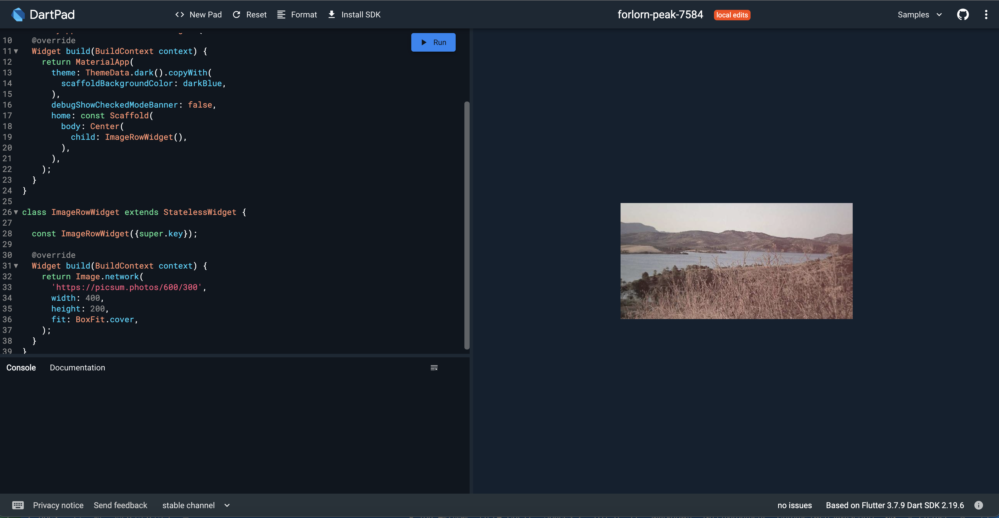
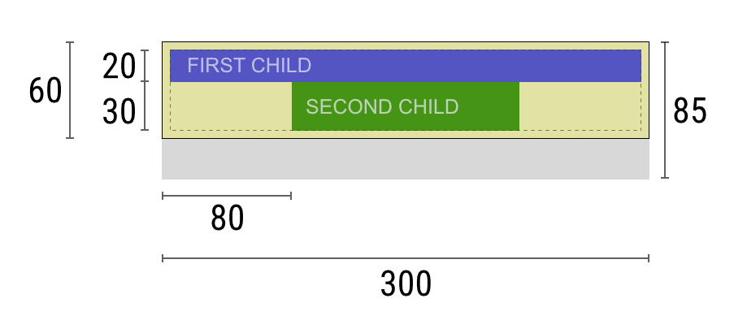
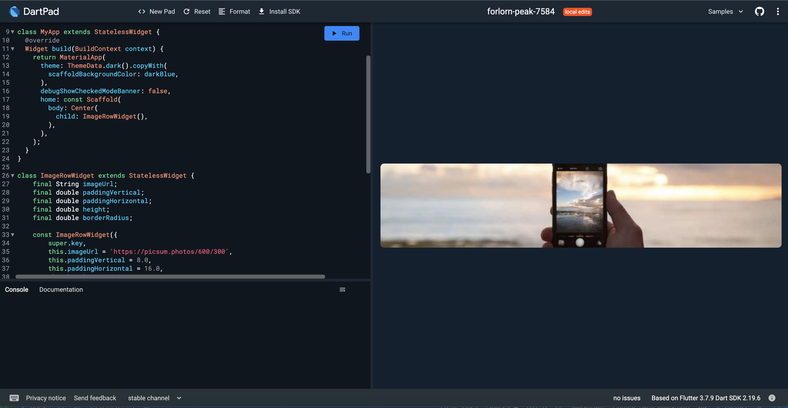
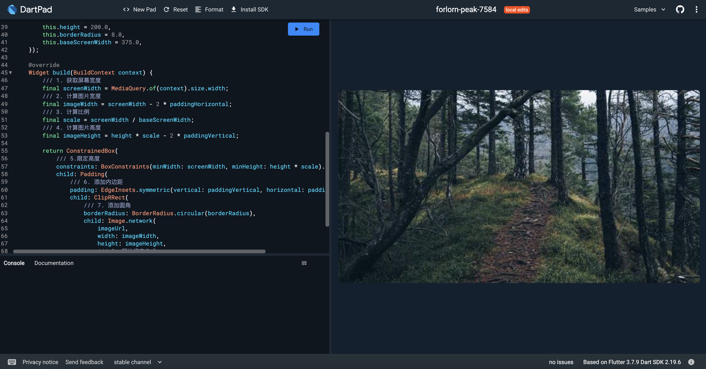
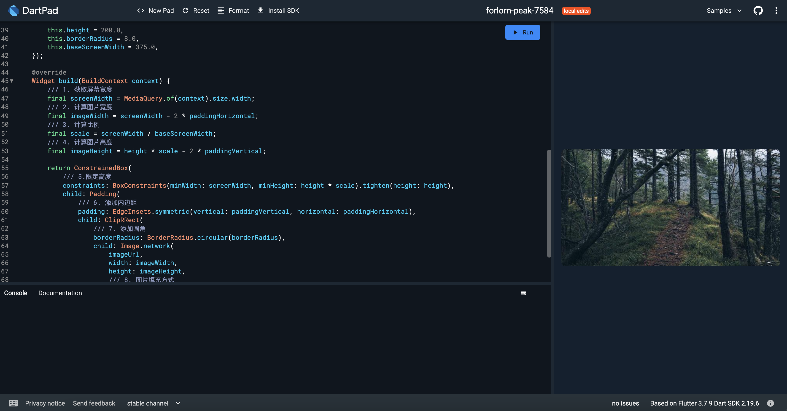

# App 的图片类组件

我们在第一章介绍了大概的需求，现在我们再来专注于图片类组件的需求和实现。

## 在“做”中理解需求

由于图片类组件支持的图片数量不是固定的，每一种类型可能需要咨询 UI 设计师，因为一般来说一行一张图片的长宽比和一行两张图片的长宽比是不一样的。一行 3 张和一行多张可滚动也是应该分别有不同考虑的。

那么为了让大家在学习 `flutter` 的同时，实现一个比较完整的图片类组件，我们这里就以一行一张为例开始从简单到复杂的实现。

一个最简单的图片组件，只需要一个 `Image` 组件就可以了。我们先来看一下

```dart
import 'package:flutter/material.dart';

class ImageRowWidget extends StatelessWidget {

  const ImageRowWidget({super.key});

  @override
  Widget build(BuildContext context) {
    return Image.network(
      'https://picsum.photos/600/300',
      /// 图片宽度
      width: 400,
      /// 图片高度
      height: 200,
      /// 图片填充方式
      /// BoxFit.fill: 全图显示，显示可能拉伸
      /// BoxFit.contain: 全图显示，显示原比例，不充满
      /// BoxFit.cover: 显示可能拉伸，充满，但不一定显示全部
      /// BoxFit.fitWidth: 宽度充满，显示可能拉伸
      /// BoxFit.fitHeight: 高度充满，显示可能拉伸
      /// BoxFit.scaleDown: 效果和 contain 差不多，但是此属性不允许显示超过源图片大小，可小不可大
      /// BoxFit.none: 不缩放
      /// 详情请参考：https://api.flutter.dev/flutter/painting/BoxFit.html
      fit: BoxFit.cover,
    );
  }
}
```

上面的代码比较简单，我们来看一下效果。

```dart
import 'package:flutter/material.dart';
const Color darkBlue = Color.fromARGB(255, 18, 32, 47);

void main() {
  runApp(MyApp());
}

class MyApp extends StatelessWidget {
  @override
  Widget build(BuildContext context) {
    return MaterialApp(
        /// 设置主题，这里使用的是 dark 模式
        /// 也可以使用 ThemeData.light() 来设置 light 模式
      theme: ThemeData.dark().copyWith(
        /// 设置主题色
        /// 除了主题色，还有 accentColor、primaryColor、primaryColorDark、primaryColorLight 可以设置
        scaffoldBackgroundColor: darkBlue,
      ),
      /// 关闭 debug 模式的 banner
      debugShowCheckedModeBanner: false,
      /// Scaffold 是 Material 库中提供的页面脚手架，包含导航栏、抽屉、FloatingActionButton 等
      home: const Scaffold(
        body: Center(
          child: ImageRowWidget(),
        ),
      ),
    );
  }
}
```



如果像上面那样，一张图的显示看起来还是比较简单的，但我们需要深入思考一下，这样的图片组件是否能满足我们的需求呢？

我们先来看一下我们的需求：

- 需求 1.1.1: 区块的定义就是一个包括内边距的矩形区域
- 需求 1.1.3: 图片行可以放一张图片，也可以放多张图片
  - 需求 1.1.3.1: 图片行中的图片是可以配置图片的链接以及点击跳转的链接
  - 需求 1.1.3.2: 一张图片时，图片按 `区块的宽度 - 2*内边距` 等比例缩放
  - 需求 1.1.3.3: 多于 3 张图片时，会形成可横向滑动的列表效果
  - 需求 1.1.3.4: 2-3 张图片时，会形成等宽的效果，也就是说，图片按 `区块的宽度 - 2*内边距 - 间距` 等比例缩放

我们不是单单要实现一个图片组件，而是要实现一个图片行组件，图片行要考虑的东西比较多，我们先来看一下最简单的一张图片的实现。简单来说，对一张图片而言，我们需要在之前的组件外面包裹一层 `Padding` 组件，然后设置 `Padding` 组件的 `padding` 属性，这样就可以实现图片的内边距了。

```dart
import 'package:flutter/material.dart';

class ImageRowWidget extends StatelessWidget {
  const ImageRowWidget({super.key});

  @override
  Widget build(BuildContext context) {
    return Padding(
      padding: const EdgeInsets.all(16.0),
      child: Image.network(
        'https://picsum.photos/600/300',
        width: 400,
        height: 200,
        fit: BoxFit.cover,
      ),
    );
  }
}
```

为了约束图片的宽高，我们还需要在其外层再包裹一层 `ConstrainedBox` 组件，然后设置 `ConstrainedBox` 组件的 `constraints` 属性，这样就可以实现图片的宽高了。

```dart
import 'package:flutter/material.dart';

class ImageRowWidget extends StatelessWidget {
  const ImageRowWidget({super.key});

  @override
  Widget build(BuildContext context) {
    return ConstrainedBox(
      constraints: BoxConstraints(
        minHeight: 200,
        minWidth: 400,
      ),
      child: Padding(
        padding: const EdgeInsets.all(16.0),
        child: Image.network(
          'https://picsum.photos/600/300',
          width: 400,
          height: 200,
          fit: BoxFit.cover,
        ),
      ),
    );
  }
}
```

那么为什么图片一届指定了宽高，还要再包裹一层 `ConstrainedBox` 组件呢？这是因为 Flutter 中组件的大小其实是由其父组件来决定的，我们在 `Image` 组件中设置了 `width` 和 `height` 属性，但是这些属性只是作为 `Image` 组件的建议值，而不是强制值，所以我们需要在其外层再包裹一层 `ConstrainedBox` 组件，然后设置 `ConstrainedBox` 组件的 `constraints` 属性，这样就可以实现图片的宽高了。

### Flutter 布局原则

这里单独提一下 Flutter 布局的原则： `Constraints go down. Sizes go up. Parent sets position.` 。

1. 组件从其父组件处获取约束，一个约束简单讲是 4 个值：最小宽度、最大宽度、最小高度、最大高度。
2. 然后这个组件循环遍历其子组件，将其约束传递给子组件。然后询问子组件想要的大小。
3. 然后，这个组件对其子组件逐个进行位置的排列（横向的 x 坐标和纵向的 y 坐标）。
4. 最后，这个组件将其大小告诉它的父组件。



以上图为例子，我们拟人一下这个过程，上图的整体是一个组件，我们给它起个名字 `W` ，这个组件 `W` 有两个子组件分别是 `FIRST CHILD` 和 `SECOND CHILD`。

1. 首先 `W` 询问它的父组件 `P` 有什么约束 ？
2. 父组件 `P` 回答 `W` ，你必须保证宽度在 `80px` 到 `300px` 之间，高度在 `30px` 到 `85px` 之间。
3. `W` 自己想要 5 个像素的内边距，这样 `W` 的子组件最多拥有 290px 的宽度和 75px 的高度。
4. 于是 `W` 对第一个子组件 `FIRST CHILD` 说，你的宽度必须在 `0` 到 `290px` 之间，你的高度必须在 `0` 到 `75px` 之间。
5. `FIRST CHILD` 回答 `W` ，我想要 `290px` 的宽度和 `20px` 的高度。
6. `W` 对第二个子组件 `SECOND CHILD` 说，你的宽度必须在 `0` 到 `290px` 之间，你的高度必须在 `0` 到 `55px` 之间。
7. `SECOND CHILD` 回答 `W` ，我想要 `140px` 的宽度和 `30px` 的高度。
8. `W` 知道了所有子组件的大小，于是它开始排列子组件的位置，`FIRST CHILD` 的位置是 `(5, 5)` ，`SECOND CHILD` 的位置是 `(80, 25)` 。
9. `W` 知道了自己的大小，于是它告诉父组件 `P` ，我想要 `300px` 的宽度和 `60px` 的高度。

因此，这时我们可以看出 Flutter 的布局上有自身的限制，当然任何其他的框架都是如此。这些限制有以下几点：

- 一个组件仅在其父组件给其约束的情况下才能决定自身的大小。这意味着组件通常情况下 **不能任意获得其想要的大小**。
- 一个组件 **无法知道，也不需要决定**其在屏幕中的位置。因为它的位置是由其父组件决定的。
- 由于父组件自身也有父组件，因此组件的大小位置是由整个组件树决定的。
- 如果子级想要拥有的大小，但父级没有足够的空间，子级的设置的大小可能会不生效。当定义了对齐方式的时候，尤其需要注意这一点。

之所以单独一节来讲 flutter 布局，一方面是因为这是 flutter 的核心，另一方面是因为在我们的项目中，后端 API 会下发数据给前端 App，App 根据这个数据进行渲染，但这个数据最好是能贴合前端的渲染方式，否则前端会觉得不方便或者很难实现。这也是全栈技能的重要性，你会同时知道前端和后端的需求，然后进行协调。

### 挖掘隐性需求

上面的例子中，我们只是简单的将图片的宽高设置为固定值，但是在实际开发中，我们需要根据屏幕的宽度来动态的设置图片，这里其实就遇到了一个最开始我们没有考虑到的需求：设备适配。

要知道不同的设备屏幕分辨率是不一样的，如果我们不做适配，那么在不同的设备上显示的图片就会不一样，这显然是不合理的。因此，我们需要根据屏幕的宽度来动态的设置图片。

当然，我们考虑到边距的问题，其实边距也应该是根据屏幕的宽度来动态的设置。如果进一步的扣一下细节，字体要不要呢？所以你看，适配是一个相当复杂的问题。

要把需求真正落地，我们还是需要约束需求的范围，否则就是一个设备适配就可以把我们搞崩溃。因此，我们需要把需求的范围缩小到一个合理的范围，这样才能更好的实现需求。

下面我们来考虑一下如何进行适配，还是通过修改之前的代码来实现。

```dart
import 'package:flutter/material.dart';

class ImageRowWidget extends StatelessWidget {
    final String imageUrl;
    final double paddingVertical;
    final double paddingHorizontal;
    final double height;
    final double borderRadius;

    const ImageRowWidget({
        super.key,
        this.imageUrl = 'https://picsum.photos/600/300',
        this.paddingVertical = 8.0,
        this.paddingHorizontal = 16.0,
        this.height = 200.0,
        this.borderRadius = 8.0,
    });

    @override
    Widget build(BuildContext context) {
        /// 1. 获取屏幕宽度
        final screenWidth = MediaQuery.of(context).size.width;
        /// 2. 计算图片宽度
        final imageWidth = screenWidth - 2 * paddingHorizontal;
        /// 3. 计算图片高度
        final imageHeight = height - 2 * paddingVertical;

        return ConstrainedBox(
            /// 4.限定高度
            constraints: BoxConstraints(minWidth: screenWidth, minHeight: height).tighten(height: height),
            child: Padding(
                /// 5. 添加内边距
                padding: EdgeInsets.symmetric(vertical: paddingVertical, horizontal: paddingHorizontal),
                child: ClipRRect(
                    /// 6. 添加圆角
                    borderRadius: BorderRadius.circular(borderRadius),
                    child: Image.network(
                        imageUrl,
                        width: imageWidth,
                        height: imageHeight,
                        /// 7. 图片填充方式
                        fit: BoxFit.cover,
                    ),
                ),
            )
        );
    }
}
```

得到的效果呢，就是这个样子：



你可尝试调整模拟器的宽度，看看图片的宽度是否会随着屏幕的宽度而变化。

### 组件的比例放缩

前面的例子中，我们已经实现了图片的宽度随着屏幕的宽度而变化，但是图片的高度还是固定的，这显然是不合理的。因此，我们需要根据屏幕的宽度来动态的设置图片的高度。

当然，有一些组件或者 UI 上设计要求定高的，但大部分情况下，我们都是需要根据屏幕的宽度来动态的设置图片的高度。因为这样最能符合很多公司要求高度还原设计稿的需求。

但是如果要按比例放缩，存在一个问题，比例我们需要 2 个数字，我们现在可以得到屏幕宽度，另一个数字呢？应该就是设计稿给出的宽度了，一般公司的 UI 设计都给出一个设计时使用的屏幕宽度，我们这里把这个数字叫做 `基准屏幕宽度` 。我们这里的比例就是 `屏幕宽度 / 基准屏幕宽度` 。因此修改一下上面的代码，我们再引入一个成员变量 `baseScreenWidth` ，用来表示基准屏幕宽度。

```dart
import 'package:flutter/material.dart';

class ImageRowWidget extends StatelessWidget {
    final String imageUrl;
    final double paddingVertical;
    final double paddingHorizontal;
    final double height;
    final double borderRadius;
    final double baseScreenWidth;

    const ImageRowWidget({
        super.key,
        this.imageUrl = 'https://picsum.photos/600/300',
        this.paddingVertical = 8.0,
        this.paddingHorizontal = 16.0,
        this.height = 200.0,
        this.borderRadius = 8.0,
        this.baseScreenWidth = 375.0,
    });

    @override
    Widget build(BuildContext context) {
        /// 1. 获取屏幕宽度
        final screenWidth = MediaQuery.of(context).size.width;
        /// 2. 计算图片宽度
        final imageWidth = screenWidth - 2 * paddingHorizontal;
        /// 3. 计算比例
        final scale = screenWidth / baseScreenWidth;
        /// 4. 计算区块高度
        final blockHeight = height * scale;
        /// 5. 计算图片高度
        final imageHeight = blockHeight - 2 * paddingVertical;

        return ConstrainedBox(
            /// 6.限定高度
            constraints: BoxConstraints(minWidth: screenWidth, minHeight: blockHeight).tighten(height: blockHeight),
            child: Padding(
                /// 7. 添加内边距
                padding: EdgeInsets.symmetric(vertical: paddingVertical, horizontal: paddingHorizontal),
                child: ClipRRect(
                    /// 8. 添加圆角
                    borderRadius: BorderRadius.circular(borderRadius),
                    child: Image.network(
                        imageUrl,
                        width: imageWidth,
                        height: imageHeight,
                        /// 9. 图片填充方式
                        fit: BoxFit.cover,
                    ),
                ),
            )
        );
    }
}
```

现在你调整模拟器的宽度，看看图片的高度是否会随着屏幕的宽度而变化。





### 适配边距

前面的例子中，我们已经实现了图片的宽度和高度随着屏幕的宽度而变化，但是图片的内边距还是固定的，这个如果是要求较严格的 UI 设计，可能也会需要根据屏幕的宽度来动态的设置图片的内边距。这可以避免在小屏幕上出现过大的内边距，或者在大屏幕上出现过小的内边距。

再修改一下前面的代码

```dart
import 'package:flutter/material.dart';

class ImageRowWidget extends StatelessWidget {
    final String imageUrl;
    final double paddingVertical;
    final double paddingHorizontal;
    final double height;
    final double borderRadius;
    final double baseScreenWidth;

    const ImageRowWidget({
        super.key,
        this.imageUrl = 'https://picsum.photos/600/300',
        this.paddingVertical = 8.0,
        this.paddingHorizontal = 16.0,
        this.height = 200.0,
        this.borderRadius = 8.0,
        this.baseScreenWidth = 375.0,
    });

    @override
    Widget build(BuildContext context) {
        /// 1. 获取屏幕宽度
        final screenWidth = MediaQuery.of(context).size.width;
        /// 2. 计算比例
        final scale = screenWidth / baseScreenWidth;
        /// 3. 计算水平内边距
        final scaledPaddingHorizontal = paddingHorizontal * scale;
        /// 4. 计算垂直内边距
        final scaledPaddingVertical = paddingVertical * scale;
        /// 5. 计算图片宽度
        final imageWidth = screenWidth - 2 * scaledPaddingHorizontal;
        /// 6. 计算区块高度
        final blockHeight = height * scale;
        /// 7. 计算图片高度
        final imageHeight = blockHeight - 2 * scaledPaddingVertical;

        return ConstrainedBox(
            /// 8.限定高度
            constraints: BoxConstraints(minWidth: screenWidth, minHeight: blockHeight).tighten(height: blockHeight),
            child: Padding(
                /// 9. 添加内边距
                padding: EdgeInsets.symmetric(vertical: scaledPaddingVertical, horizontal: scaledPaddingHorizontal),
                child: ClipRRect(
                    /// 10. 添加圆角
                    borderRadius: BorderRadius.circular(borderRadius),
                    child: Image.network(
                        imageUrl,
                        width: imageWidth,
                        height: imageHeight,
                        /// 11. 图片填充方式
                        fit: BoxFit.cover,
                    ),
                ),
            )
        );
    }
}
```

### 使用 Dart 的扩展方法改写

由于 Flutter 的特点是一层层的 `Widget` 嵌套，这导致一个问题，就是如果嵌套多了的情况下会造成几个问题

1. 代码不清晰：嵌套太多会很难找到对应的组件，或者理清楚其中的逻辑。
2. 修改比较繁琐：在开发阶段，我们经常可能会改变这个树的层次或者内部结构，这种嵌套结构改起来比较费力。

当然一般做法可以把一些子组件抽取出来，抽象为单独的组件。另一种方式其实是利用 `dart` 的扩展方法来帮我们把嵌套的写法变为 `builder` 的模式。

那么什么是扩展方法？扩展方法就是在一个类上添加一个方法，这个方法可以直接在类的实例上调用，就好像是这个类的方法一样。这个方法的实现是在另一个类中实现的，这个类就是扩展方法的 `receiver`。

这么说还是有点抽象，我们来看一个例子。下面的代码中，我们创建了 `WidgetExtension` 类，然后在这个类中添加了一个 `padding` 方法，这个方法的 `receiver` 是 `Widget` 类，也就是说这个方法可以在 `Widget` 类的实例上调用。

```dart
extension WidgetExtension on Widget {

  Widget padding({
    Key? key,
    double? all,
    double? horizontal,
    double? vertical,
    double? top,
    double? bottom,
    double? left,
    double? right,
  }) =>
      Padding(
        key: key,
        padding: EdgeInsets.only(
          top: top ?? vertical ?? all ?? 0.0,
          bottom: bottom ?? vertical ?? all ?? 0.0,
          left: left ?? horizontal ?? all ?? 0.0,
          right: right ?? horizontal ?? all ?? 0.0,
        ),
        child: this,
      );
}
```

具体来讲，这个 `padding` 方法的作用就是在 `Widget` 的外面包一层 `Padding` 组件，这样就可以在 `Widget` 的外面添加内边距了。

```dart
Padding(
  padding: EdgeInsets.all(16.0),
  child: Text('Hello World'),
)
```

上面的代码可以改写为

```dart
Text('Hello World').padding(all: 16.0)
```

这样就可以非常简洁的添加内边距了，而且易于维护，比如以后我们不想要 padding 了，就直接删掉 `.padding(all: 16.0)` 就行了。

我们再来定义几个扩展方法，`constrained` 用来替代嵌套 `ConstrainedBox` ，而 `clipRRect` 用来替代嵌套 `ClipRRect`

```dart
extension WidgetExtension on Widget {

  Widget constrained({
    Key? key,
    double? width,
    double? height,
    double minWidth = 0.0,
    double maxWidth = double.infinity,
    double minHeight = 0.0,
    double maxHeight = double.infinity,
  }) {
    BoxConstraints constraints = BoxConstraints(
      minWidth: minWidth,
      maxWidth: maxWidth,
      minHeight: minHeight,
      maxHeight: maxHeight,
    );
    constraints = (width != null || height != null)
        ? constraints.tighten(width: width, height: height)
        : constraints;
    return ConstrainedBox(
      key: key,
      constraints: constraints,
      child: this,
    );
  }

  Widget clipRRect({
    Key? key,
    double? all,
    double? topLeft,
    double? topRight,
    double? bottomLeft,
    double? bottomRight,
    CustomClipper<RRect>? clipper,
    Clip clipBehavior = Clip.antiAlias,
  }) =>
      ClipRRect(
        key: key,
        clipper: clipper,
        clipBehavior: clipBehavior,
        borderRadius: BorderRadius.only(
          topLeft: Radius.circular(topLeft ?? all ?? 0.0),
          topRight: Radius.circular(topRight ?? all ?? 0.0),
          bottomLeft: Radius.circular(bottomLeft ?? all ?? 0.0),
          bottomRight: Radius.circular(bottomRight ?? all ?? 0.0),
        ),
        child: this,
      );
}
```

根据之前的扩展方法，我们改写一下 `ImageRowWidget`

```dart
import 'package:flutter/material.dart';

class ImageRowWidget extends StatelessWidget {
  final String imageUrl;
  final double screenWidth;
  final double blockHeight;
  final double scaledPaddingVertical;
  final double scaledPaddingHorizontal;
  final double borderRadius;

  const ImageRowWidget({
    Key? key,
    required this.imageUrl,
    required this.screenWidth,
    required this.blockHeight,
    required this.scaledPaddingVertical,
    required this.scaledPaddingHorizontal,
    required this.borderRadius,
  }) : super(key: key);

  @override
  Widget build(BuildContext context) {
    /// 1. 获取屏幕宽度
    final screenWidth = MediaQuery.of(context).size.width;
    /// 2. 计算比例
    final scale = screenWidth / baseScreenWidth;
    /// 3. 计算水平内边距
    final scaledPaddingHorizontal = paddingHorizontal * scale;
    /// 4. 计算垂直内边距
    final scaledPaddingVertical = paddingVertical * scale;
    /// 5. 计算图片宽度
    final imageWidth = screenWidth - 2 * scaledPaddingHorizontal;
    /// 6. 计算区块高度
    final blockHeight = height * scale;
    /// 7. 计算图片高度
    final imageHeight = blockHeight - 2 * scaledPaddingVertical;

    return Image.network(
      imageUrl,
      width: imageWidth,
      height: imageHeight,
      fit: BoxFit.cover,
    ).clipRRect(
      all: borderRadius,
    ).padding(
      vertical: scaledPaddingVertical,
      horizontal: scaledPaddingHorizontal,
    ).constrained(
      width: screenWidth,
      height: blockHeight,
    );
  }
}
```

大家可以明显看到这种写法非常简洁，而且易于维护，所以在后面的代码中我们会尽量使用这种写法，但不是所有都这样，遇到新的扩展方法我会提到，但不会逐字敲这个扩展方法了。

我们在 `common/lib/extensions/widget_extensions.dart` 中写了很多这种扩展方法，这个类就留给大家进行阅读和练习，大部分的扩展方法其实就是一个转换器，把嵌套写法转换为了 `builder` 的方式。
