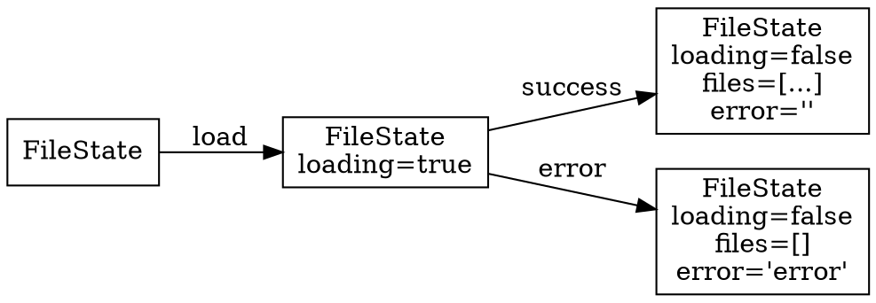

```dot
digraph G {
  node [shape=record];
  rankdir=LR;
  init [label="FileState"];
  loading [label="FileState\nloading=true"];
  loaded [label="FileState\nloading=false\nfiles=[...]\nerror=''"];
  error [label="FileState\nloading=false\nfiles=[]\nerror='error'"];
  init -> loading [label="load"];
  loading -> loaded [label="success"];
  loading -> error [label="error"];
}
```
