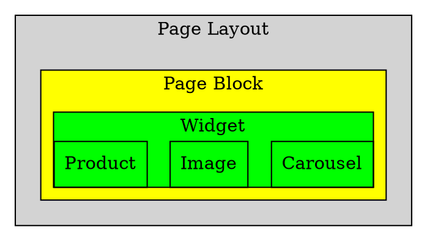

```dot
digraph G {
  rankdir=TD;
  node [shape=box];
  edge[dir=none];
  overlap = true;

  subgraph cluster_p {
    margin=20.0;
    label = "Page Layout";
    landscape = true;
    style = "filled";
    fillcolor = "lightgrey";

    subgraph cluster_c1 {
      margin=10.0;
      label = "Page Block";
      style = "filled";
      fillcolor = "yellow";

      subgraph cluster_c1_1 {
        margin=0.0;
        label = "Widget";
        node [shape=box];
        edge[dir=none];
        overlap = true;
        style = "filled";
        fillcolor = "green";
        c1_1_1 [label="Carousel"];
        c1_1_2 [label="Image"];
        c1_1_3 [label="Product"];
      }
    }
  }
}
```
