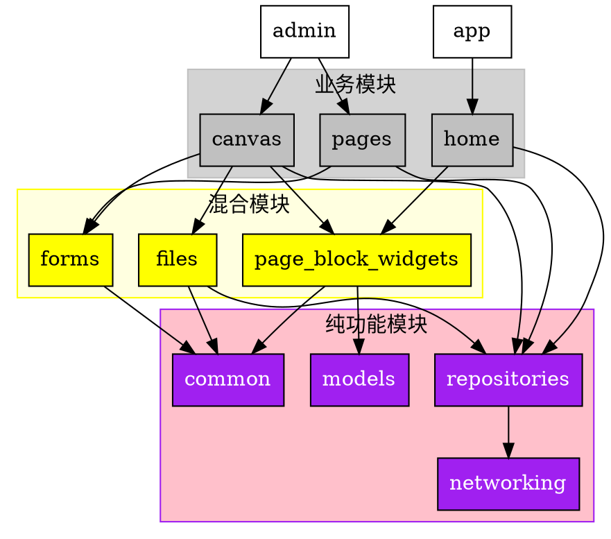

```dot
digraph G {
  rankdir=TD;
  node [shape=box];
  canvas [label="canvas", style=filled, fillcolor="grey"];
  pages [label="pages", style=filled, fillcolor="grey"];
  home [label="home", style=filled, fillcolor="grey"];
  page_block_widgets [label="page_block_widgets", style=filled, fillcolor="yellow"];
  files [label="files", style=filled, fillcolor="yellow"];
  forms [label="forms", style=filled, fillcolor="yellow"];
  repositories [label="repositories", style=filled, fillcolor="purple", fontcolor="white"];
  networking [label="networking", style=filled, fillcolor="purple", fontcolor="white"];
  models [label="models", style=filled, fillcolor="purple", fontcolor="white"];
  common [label="common", style=filled, fillcolor="purple", fontcolor="white"];
  admin -> canvas;
  admin -> pages;
  app -> home;
  canvas -> page_block_widgets;
  home -> page_block_widgets;
  page_block_widgets -> models;
  page_block_widgets -> common;
  canvas -> files;
  files -> repositories;
  files -> common;
  repositories -> networking;
  pages -> forms;
  canvas -> forms;
  forms -> common;
  pages -> repositories;
  canvas -> repositories;
  home -> repositories;

  subgraph cluster_0 {
    label = "业务模块";
    color = "grey";
    style = "filled";
    fillcolor = "lightgrey";
    canvas;
    pages;
    home;
  }

  subgraph cluster_1 {
    label = "混合模块";
    color = "yellow";
    style = "filled";
    fillcolor = "lightyellow";
    page_block_widgets;
    files;
    forms;
  }

  subgraph cluster_2 {
    label = "纯功能模块";
    color = "purple";
    style = "filled";
    fillcolor = "pink";
    repositories;
    networking;
    models;
    common;
  }

}
```
