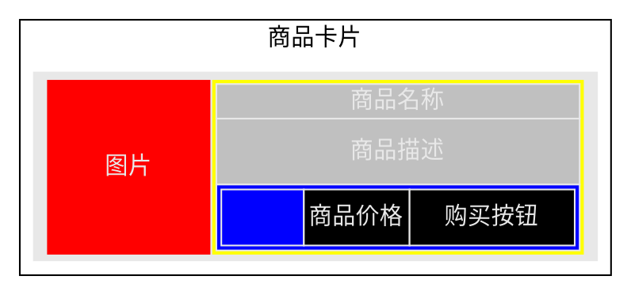

```dot
digraph G {
  rankdir=LR;
  node [shape=record];
  subgraph cluster_0 {
    label="商品卡片";
    node [style=filled];
    node [fillcolor="#e8e8e8"];
    node [color="#e8e8e8"];
    node [fontcolor="#e8e8e8"];
    node [shape=plaintext];
    "商品卡片" [label=<
      <table border="0" cellborder="1" cellspacing="0">
        <tr>
          <td width="100" height="100" bgcolor="red">图片</td>
          <td width="200" height="100" bgcolor="yellow">
            <table border="0" cellborder="1" cellspacing="0">
              <tr>
                <td width="200" height="20" bgcolor="grey">商品名称</td>
              </tr>
              <tr>
                <td width="200" height="40" bgcolor="grey">商品描述</td>
              </tr>
              <tr>

                <td width="100" height="40" bgcolor="blue">
                  <table border="0" cellborder="1" cellspacing="0">
                    <tr>
                    <td width="50"></td>
                      <td width="25" height="25" bgcolor="#000000">商品价格</td>
                      <td width="100" height="25" bgcolor="#000000">购买按钮</td>
                    </tr>
                  </table>
                </td>
              </tr>
            </table>
          </td>
        </tr>

      </table>
    >];
  }
}
```
