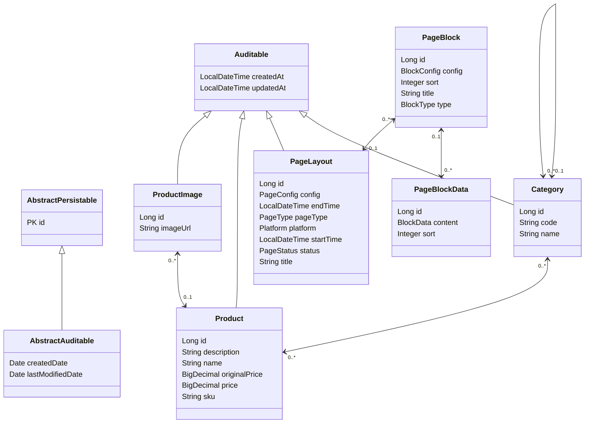

```mermaid
classDiagram
direction BT
class AbstractAuditable {
    Date  createdDate
    Date  lastModifiedDate
}
class AbstractPersistable {
    PK  id
}
class Auditable {
    LocalDateTime  createdAt
    LocalDateTime  updatedAt
}
class Category {
    Long  id
    String  code
    String  name
}
class PageBlock {
    Long  id
    BlockConfig  config
    Integer  sort
    String  title
    BlockType  type
}
class PageBlockData {
    Long  id
    BlockData  content
    Integer  sort
}
class PageLayout {
    Long  id
    PageConfig  config
    LocalDateTime  endTime
    PageType  pageType
    Platform  platform
    LocalDateTime  startTime
    PageStatus  status
    String  title
}
class Product {
    Long  id
    String  description
    String  name
    BigDecimal  originalPrice
    BigDecimal  price
    String  sku
}
class ProductImage {
    Long  id
    String  imageUrl
}

AbstractAuditable  --|>  AbstractPersistable
Category  --|>  Auditable
Category "0..1" <--> "0..*" Category
PageBlockData "0..*" <--> "0..1" PageBlock
PageLayout  --|>  Auditable
PageLayout "0..1" <--> "0..*" PageBlock
Product  --|>  Auditable
Product "0..*" <--> "0..*" Category
Product "0..1" <--> "0..*" ProductImage
ProductImage  --|>  Auditable
```
